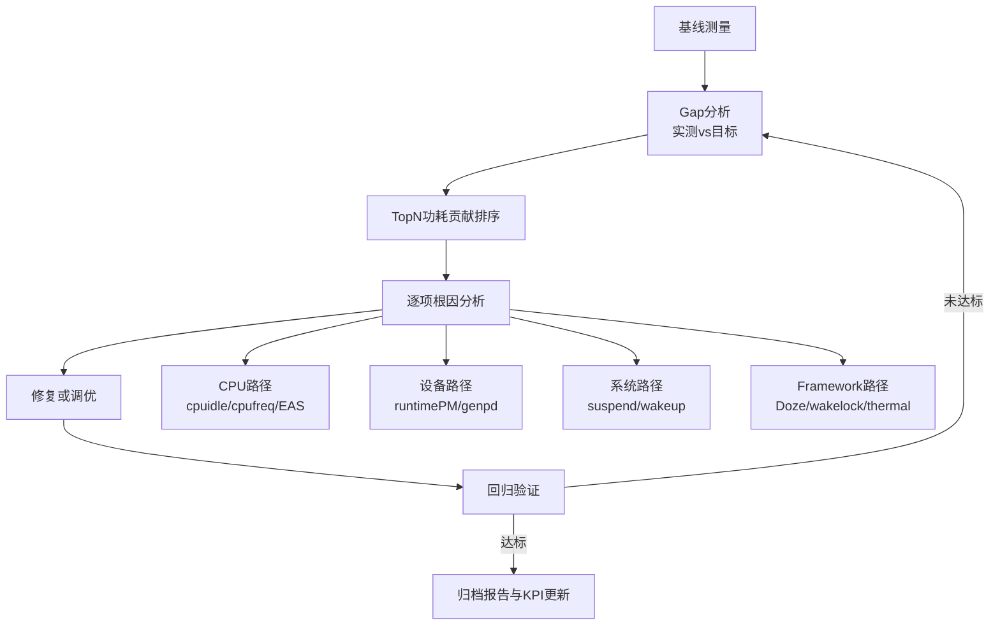

# 新手机功耗性能分析与调优全流程 SOP（ARM + Android）

> **文档目的**：约束团队在「新手机 / 新平台」项目上的功耗与性能分析工作——**做什么、按什么顺序做、如何判定瓶颈、如何闭环验证**。  
> **适用范围**：ARM SoC（big.LITTLE、PSCI、SCMI 等常见形态）+ Android（AOSP 系 BSP）。  
> **维护说明**：各章「判定标准」中的数值（如待机 mW、唤醒次数）需由项目组按 **电池容量、产品档位、竞品对标** 在《功耗 KPI 规格书》中单独立项；本文给出的是**流程与证据链**，而非替代产品指标。

---

## 文档导航与仓库内延伸阅读

| 主题 | 推荐阅读 |
|------|-----------|
| 仪器与内核调试方法论 | [08_soc_lp_lab_instruments_debug_zh.md](../tech_evolution/08_soc_lp_lab_instruments_debug_zh.md) |
| 低功耗子系统总览（通俗） | [低功耗做什么.md](../core_concepts/低功耗做什么.md)、[cpuidle原理.md](../core_concepts/cpuidle原理.md) |
| CPUFreq / CPUIdle / EAS / SCMI 年代线 | [01_2010-2012_clock_dvfs_suspend.md](../tech_evolution/01_2010-2012_clock_dvfs_suspend.md)、[02_2013-2015_biglittle_eas_psci.md](../tech_evolution/02_2013-2015_biglittle_eas_psci.md)、[03_2016-2017_schedutil_dynamiq_scmi.md](../tech_evolution/03_2016-2017_schedutil_dynamiq_scmi.md) |
| 显示 / LTPO / trace | [04_2018-2019_display_vrr_trace.md](../tech_evolution/04_2018-2019_display_vrr_trace.md)、[05_2020-2021_perfhint_ltpo_adpf.md](../tech_evolution/05_2020-2021_perfhint_ltpo_adpf.md) |
| 平台负责人向（以 RK3588 为例） | [00_RK3588_低功耗负责人关注面总览_zh.md](../rk3588/00_RK3588_低功耗负责人关注面总览_zh.md)、[09_现场测量与日志方法论_zh.md](../rk3588/09_现场测量与日志方法论_zh.md) |
| 实验阶段模板 | [phase0_baseline.md](../learning_plan/phase0_baseline.md) ～ [phase5_upstream_output.md](../learning_plan/phase5_upstream_output.md) |
| 内核 PM 源码索引导航 | [kernel_pm_map.md](../kernel_pm_map.md) |
| 自动化脚本 | [scripts/power/README.md](../../../scripts/power/README.md) |
| 历史缺陷案例（调试 SOP 参考） | [bugs_archive/README.md](../bugs_archive/README.md) |

---

## 第一章：项目准备与硬件环境搭建

### 1.1 目的与范围

- **目的**：在投入大规模测量前，保证 **可重复、可对比、可追责** 的实验条件；避免因线材、固件形态、内核配置不一致导致「假瓶颈」。
- **范围**：硬件测量链、软件镜像、内核/固件与 DTS 关键信息归档。
- **模板化清单**：可与 [phase0_baseline.md](../learning_plan/phase0_baseline.md) 中的平台基线项对照填写，避免遗漏 cpuidle/cpufreq、devfreq、genpd、wakeup 等关键信息。

### 1.2 硬件清单（建议最低配置 + 推荐配置）

| 类别 | 最低配置 | 推荐配置 | **原因（为何要这样配）** |
|------|-----------|-----------|---------------------------|
| 样机 | 工程机 / EVB | 与量产天线、电池 pack 接近的整机 | 射频与电源路径对待机电流影响极大 |
| 供电测量 | 实验室电源串联精密分流器 + DMM | SMU（如 Keysight N6705C 类） | SMU 可编程、采样率高，利于抓短脉冲负载 |
| 波形确认 | 无 | 示波器 + 电流探头 / 差分电压 | 区分「真平均电流」与「burst + 休眠」混合波形 |
| 热特性 | 环境温度计 | 热像仪 | 热限制会同时改变 **功耗与性能**，必须关联 |
| 总线/唤醒排障 | 无 | 逻辑分析仪（GPIO / IRQ 探针） | 幽灵唤醒、错误 IRQ 常需硬件时间关联 |

### 1.3 软件环境

1. **镜像形态**：优先 **userdebug**（可 `adb root`、可抓 trace、可开 `CONFIG_PM_DEBUG` 等调试选项）。  
   - **原因**：user 版常关闭调试接口，会导致证据链断裂，无法做系统化审计。

2. **ADB 与权限**：确认 `adb shell` 可访问：
   - `/sys/kernel/debug`（部分机型需 `mount -t debugfs none /sys/kernel/debug`）
   - `perfetto` / `atrace` 所需权限（按项目安全策略申请）

3. **内核配置检查（自检清单）**  
   由 BSP 负责人勾选并归档到《内核 PM 配置矩阵》：

   - `CONFIG_PM_SLEEP`、`CONFIG_PM_RUNTIME`
   - `CONFIG_CPU_IDLE`、`CONFIG_CPU_FREQ`
   - `CONFIG_TRACING`、`CONFIG_FTRACE`（及 `power` 相关 trace event）
   - 厂商 SoC 驱动依赖项（如 `CONFIG_ARM_SCMI_*`、`CONFIG_DEVFREQ_*`）

### 1.4 DTS / 固件 / 硬件信息确认（必须归档）

在《平台功耗档案》中记录以下项（复制路径 + 版本号 + 责任人）：

| 项目 | 典型路径 / 命令 | **原因** |
|------|------------------|----------|
| 电源域与 PD 绑定 | DTS `power-domains`、`../rk3588/01_SoC电源域与硬件架构_zh.md` 思路 | PD 未关 = 子系统漏电或时钟未断 |
| OPP / 频点表 | DTS `operating-points-v2`、内核 `opp` 表 | DVFS 错误会同时伤 **性能与能效** |
| PMIC rail 映射 | 原理图 + `regulator` 节点 | 优化需对应到 **真实供电网络** |
| BL31 / TF-A / SCP 版本 | 启动日志、`strings` 固件 | DDR 自刷新、PSCI、SCMI 与底电流强相关 |

**交付物**：`平台功耗档案 v0.1`（硬件清单表 + 软件版本表 + DTS/固件索引）。

### 1.5 判定标准（Pass / Fail）

| 检查项 | Pass 条件 |
|--------|-----------|
| 测量可重复 | 同一场景连续 3 次平均电流相对偏差 ≤ **5%**（固定温度与亮度） |
| 调试通道可用 | `wakeup_sources`、`tracing`、关键 `sysfs` 至少一项可按 SOP 访问 |
| 档案完整 | 上述归档表已评审签字（硬件 + BSP + 功耗负责人） |

---

## 第二章：基线测量（Baseline）

### 2.1 目的与范围

- **目的**：建立「当前版本」的可量化基线，作为后续优化与回归的 **唯一对比参照**。
- **范围**：场景定义、测量步骤、同步采集、报告模板。

### 2.2 场景矩阵（必测 + 选测）

**必测（静态）**

| 场景 ID | 描述 | 典型控制变量 |
|---------|------|----------------|
| B-01 | 关屏待机，飞行模式，静置 | 关闭 AOD、关闭抬腕、关蓝牙/NFC |
| B-02 | 关屏待机，WiFi 已连接 | SSID 固定、信号强度记录 |
| B-03 | 亮屏桌面 idle | 固定亮度（如 200 nit）、无用户操作 |

**必测（动态）**

| 场景 ID | 描述 | 备注 |
|---------|------|------|
| B-10 | 本地 1080p H.264 循环播放 | 扬声器关闭、固定音量 |
| B-11 | 相机预览（不录像） | 固定分辨率与帧率 |
| B-12 | 指定游戏或 GFX bench（项目定义） | 固定画质与场景 |
| B-13 | Web 浏览自动化脚本（项目定义） | 固定网络与缓存策略 |

**选测（连接）**

| 场景 ID | 描述 |
|---------|------|
| B-20 | 蜂窝数据 connected idle（慎用：运营商与小区负载影响大） |
| B-21 | BT A2DP 播放 |

**原因**：静态场景隔离 **CPU/显示/射频** 的主导因素；动态场景覆盖 **调度、GPU、多媒体、DVFS**；连接场景贴近真实但必须记录 **RSSI/小区负载** 否则不可比。

### 2.3 测量 SOP（执行顺序）

1. **环境**：固定室温（建议 25℃±2）；样机充分冷却至热稳态再开始。  
2. **预热**：开机后静置 **≥15 min**，关闭无关 App，确认无系统更新。  
3. **采样时长**：每场景 **≥5 min** 稳态；若电流仍在单调漂移，延长至 10–15 min 并记录原因。  
4. **电气记录**：平均电流 `I_avg`、峰值 `I_peak`、标准差（若 SMU 支持直接导出）。  
5. **同步 trace（强烈建议）**：
   - 内核：`trace_power` 类事件（见内核 `Documentation/trace/events-power.rst` 对应内容）
   - 建议启用：`cpu_idle`、`cpu_frequency`、`clock_enable` / `clock_disable`、`power_domain_target`（以实际内核支持为准）
   - Android：**Perfetto**（含 power rails、scheduling、display 轨道，按版本能力勾选）
6. **温度**：壳温或热点温度 + 环境温度，每场景至少记录一次。

**自动化辅助**：可使用 [`scripts/power/collect_idle_baseline.sh`](../../../scripts/power/collect_idle_baseline.sh) 采集 idle 相关 sysfs 快照（需按机型适配）。

### 2.4 基线报告模板

```text
项目：________  固件版本：________  内核：________  日期：________  测量人：________

场景ID | 场景说明 | I_avg(mA) | P_avg(mW)* | 目标(mW) | Gap(%) | 优先级 | 备注
-------|----------|-----------|------------|----------|--------|--------|------
B-01   |          |           |            |          |        |        |
...

* P_avg = I_avg × V_bat（或使用 SMU 设定电压）；整机需统一口径。
```

### 2.5 判定标准（Pass / Fail）

| 检查项 | Pass 条件 |
|--------|-----------|
| 场景合规 | 每个必测场景均有原始数据文件（csv/截图 + trace） |
| 可对比性 | 控制变量表完整（亮度、网络、温度、音量） |
| Gap 闭环 | Gap 超过阈值的场景已登记到缺陷库并指定负责人 |

---

## 第三章：CPU 子系统分析

### 3.1 目的与范围

- **目的**：将「CPU 相关功耗与性能问题」分解为 **idle 深度、频率策略、调度与能量模型** 三层，避免只盯频率或只盯大核占用。
- **范围**：cpuidle、cpufreq/DVFS、EAS/调度与热。

### 3.2 cpuidle 分析

**步骤**

1. 读取各 CPU、各 state 的 `time` / `usage`：  
   ` /sys/devices/system/cpu/cpu*/cpuidle/state*/* `
2. 计算各 C-state **驻留比例**（关屏待机场景下）。  
3. 若浅层 C-state 占比异常高：
   - 检查 `/sys/kernel/debug/wakeup_sources`（或 `/proc/wakeup_sources`）中 **总时长与次数** 异常的源
   - `cat /proc/interrupts` 做 **前后差分**，找高频 IRQ
   - ftrace：`cpu_idle` 事件观察 **频繁进出 idle** 的 pattern

**原因**：浅睡占比高通常意味着 **timer、IRQ、轮询驱动或不合理 QoS** 在「踢」CPU，功耗与抖动同时恶化。

**参考**： [cpuidle原理.md](../core_concepts/cpuidle原理.md)、[04_CPUFreq_CPUIdle_PSCI_调度_zh.md](../rk3588/04_CPUFreq_CPUIdle_PSCI_调度_zh.md)

**判定标准（建议由项目定义数值）**

| 指标 | 建议方向 |
|------|-----------|
| 关屏待机深度 idle 占比 | 显著高于「问题版本」；与竞品同场景可比 |
| 异常唤醒源 | 无「未知」或驱动长期 `active` 占 top |

### 3.3 cpufreq / DVFS 分析

**步骤**

1. 确认 governor（常见：`schedutil`）与 **可用频点**（`scaling_available_frequencies` 或 `cpuinfo_cur_freq` 统计）。  
2. 用 trace：`power:cpu_frequency` 生成 **频点直方图**（脚本或 `trace-cmd` 后处理）。  
3. 检查异常 **长时间顶频** 或 **不合理升频**：
   - `PM QoS` / `cpu_latency_qos` 请求
   - `uclamp`（Android 与内核调度接口）
   - thermal 限频与 **性能模式** 开关

**实验辅助**：[`scripts/power/run_cpuidle_cpufreq_experiments.sh`](../../../scripts/power/run_cpuidle_cpufreq_experiments.sh)（对比不同 governor 行为，**仅用于定位**；产品默认策略以项目决策为准）。

**原因**：DVFS 错误往往表现为 **卡顿 + 高功耗** 或 **流畅 + 漏电** 的组合，需要 trace 证据而不是主观感受。

**参考**： [03_2016-2017_schedutil_dynamiq_scmi.md](03_2016-2017_schedutil_dynamiq_scmi.md)、[../Documentation/cpu-freq/cpufreq_dvfs_opp_reference.md](../Documentation/cpu-freq/cpufreq_dvfs_opp_reference.md)（若树内存在）

### 3.4 调度器 / EAS / Energy Model

**步骤**

1. 在典型负载下看 **小核 vs 大核** 利用率与 **task placement**（Perfetto sched 视图）。  
2. 核对 **Energy Model** 注册是否与硬件 cluster 一致（文档：[../Documentation/power/energy-model.rst](../Documentation/power/energy-model.rst)）。  
3. 记录 **thermal throttle** 前后的 **频率与 UID 负载** 变化。

**原因**：EAS 依赖准确的 EM；热限制会改变调度决策，需与第三章 3.2、3.3 联合解读。

**参考**： [02_2013-2015_biglittle_eas_psci.md](02_2013-2015_biglittle_eas_psci.md)

### 3.5 交付物

- 《CPU 子系统诊断报告》：含 **idle 分布图、频点直方图、top 唤醒源/IRQ、与基线对比结论**。

---

## 第四章：设备与外设功耗分析

### 4.1 目的与范围

- **目的**：识别 **「本该 sleep 却仍 active」** 的设备与电源域，占新机功耗问题的极高比例。
- **范围**：Runtime PM、genpd、显示/GPU/存储/总线/音频等。

### 4.2 Runtime PM 审计

**步骤**

1. 扫描 `runtime_status`：关注长期 `active` 或 `suspended` 反复抖动设备。  
2. 对可疑设备追溯：
   - `runtime_usage`、`runtime_active_time`、`runtime_suspended_time`
   - 驱动是否正确 `pm_runtime_enable` / `pm_runtime_get` 配对
   - `autosuspend_delay_ms` 是否合理

**自动化**：[`scripts/power/runtime_pm_audit.sh`](../../../scripts/power/runtime_pm_audit.sh)

**原因**：单个驱动 **get/put 不平衡** 或 **autosuspend 未配置** 可导致整域无法下电（参见 [phase2_runtime_pm.md](../learning_plan/phase2_runtime_pm.md)）。

### 4.3 电源域（genpd）

**步骤**

1. 查看 ` /sys/kernel/debug/pm_genpd/pm_genpd_summary `（路径以实际内核为准）。  
2. 关屏静置目标：**非必要 PD 处于 off**；对仍为 on 的域，追溯到 **占用者设备**。  
3. 结合 DTS `power-domains` 理解 **层级依赖**。

**参考**： [01_SoC电源域与硬件架构_zh.md](../rk3588/01_SoC电源域与硬件架构_zh.md)

### 4.4 关键外设逐项检查清单

| 子系统 | 检查要点 | **原因** |
|--------|-----------|----------|
| 显示 | PSR/自刷新、VRR/LTPO、panel idle | 显示常是亮屏功耗第一贡献者 |
| GPU/NPU | devfreq、runtime PM、fence 完成 | 未完成 fence 会阻止下电 |
| 存储 UFS/eMMC | link 电源管理、runtime idle | 存储高功耗常与 **后台 IO** 相关 |
| USB | DWC3 runtime、OTG 角色 | 参见案例库中 OTG/锁相关问题思路 |
| PCIe | ASPM、L1.2 | 外设挂死导致链路无法省电 |
| 音频 | codec DAPM / bias | 无声泄漏电流 |

**参考专题**： [06_显示子系统_VOP_DP_MIPI_zh.md](../rk3588/06_显示子系统_VOP_DP_MIPI_zh.md)、[08_多媒体_GPU_NPU_编解码_zh.md](../rk3588/08_多媒体_GPU_NPU_编解码_zh.md)、[07_高速外设_PCIe_USB_GMAC_zh.md](../rk3588/07_高速外设_PCIe_USB_GMAC_zh.md)

### 4.5 判定标准

| 检查项 | Pass 条件 |
|--------|-----------|
| 审计覆盖 | 关屏 / 亮屏 idle 至少各扫一轮 full 报告 |
| 异常闭环 | 所有 `active` > 阈值 的设备有工单号与负责人 |
| 回归 | 修复后重复审计，确认状态符合预期 |

---

## 第五章：系统休眠与唤醒分析

### 5.1 目的与范围

- **目的**：保证 **Suspend to RAM（STR）** 或 **s2idle** 路径可靠，并将 **底电流** 与 **唤醒风暴** 控制在规格内。
- **范围**：suspend 流程、失败排障、唤醒源、底电流与固件。

### 5.2 Suspend / Resume 流程分析

**步骤**

1. 分段测试：启用 `CONFIG_PM_DEBUG` 时可用 `/sys/power/pm_test` 做 **核心 / 设备 / 平台** 分段（详见 [../Documentation/power/basic-pm-debugging.rst](../Documentation/power/basic-pm-debugging.rst)）。  
2. 失败时：`dmesg` 搜索 `timeout`、`abort`、`failed`、设备名；对照 `dpm` 打印。  
3. 自动化循环：[`scripts/power/suspend_resume_regression.sh`](../../../scripts/power/suspend_resume_regression.sh)

**原因**：suspend 失败往往不是「功耗问题」而是 **电源管理状态机错误**；需与功能稳定性同等优先级。

**参考**： [phase3_system_sleep.md](../learning_plan/phase3_system_sleep.md)、[03_内核系统休眠与唤醒源_zh.md](../rk3588/03_内核系统休眠与唤醒源_zh.md)

### 5.3 唤醒源分析

**步骤**

1. 内核：`/sys/kernel/debug/wakeup_sources` —— 关注 **event count** 与 **last change** 异常的条目。  
2. Android：`dumpsys power` —— wakelock、**partial wake**、Alarm 统计。  
3. 统计 **每小时唤醒次数**（关屏 WiFi / 蜂窝分别测）。

**目标占位**：`N` 次/小时由产品定义；本 SOP 要求 **必须能量化**。

**原因**：频繁唤醒会使系统无法停留深睡，平均电流对 **小脉冲极其敏感**。

### 5.4 Suspend 态底电流

**步骤**

1. 对比 **DDR 是否进入自刷新**（需平台文档或示波器测 DDR 时钟/片选）。  
2. 核对 PMIC **各 rail 电流**（若硬件可测）。  
3. 记录 BL31/SCP 版本与已知 errata（参见 [02_固件与信任链_BL31_DDR_zh.md](../rk3588/02_固件与信任链_BL31_DDR_zh.md) 的方法论）。

### 5.5 判定标准

| 检查项 | Pass 条件 |
|--------|-----------|
| 稳定性 | suspend/resume 连续 **≥200 次** 无失败（或项目定义） |
| 底电流 | 不高于《硬件规格》中 STR 目标；异常需硬件 + 固件联合签字 |
| 唤醒 | 无单点源「风暴式」唤醒；已修复项有前后对比数据 |

---

## 第六章：Android Framework 层分析

### 6.1 目的与范围

- **目的**：处理 **内核已省电但整机仍费电** 的常见情况——Job、Alarm、Sync、Sensor、前台服务、亮度策略等。
- **范围**：Doze/App Standby、显示与合成、后台与网络、热与性能。

### 6.2 Doze / App Standby

**步骤**

1. `adb shell dumpsys deviceidle` 查看状态迁移是否正常。  
2. 审计 **电源白名单**（厂商设定）是否过度。  
3. 对 Top 耗电 App 使用 `dumpsys batterystats --charged`（具体子命令随 Android 版本调整）。

**原因**：Framework 策略错误会导致 **集体无法深睡**，表现为散点唤醒与网络脉冲。

### 6.3 Display 与 UI 渲染

**步骤**

1. 确认 **刷新率策略**（60/90/120/LTPO）与 **实际 fps**（Perfetto / SurfaceFlinger）。  
2. 区分 **GPU 合成 vs HWC**；检查过度绘制与脏区。  
3. 亮度曲线与 **自动亮度** 传感器噪声（抖动会引起背光频繁调节）。

**参考**： [04_2018-2019_display_vrr_trace.md](04_2018-2019_display_vrr_trace.md)、[05_2020-2021_perfhint_ltpo_adpf.md](05_2020-2021_perfhint_ltpo_adpf.md)

### 6.4 后台活动审计

| 命令 / 工具 | 用途 |
|-------------|------|
| `dumpsys alarm` | 高频 alarm 来源 |
| `dumpsys jobscheduler` | 后台任务堆积 |
| `dumpsys batterystats` | wakelock、唤醒归因 |
| 网络抓包 / 统计 | 后台流氓流量 |

**原因**：**「无前台」不等于「无工作」**；后台是待机电流的头号对手之一。

### 6.5 Thermal 与性能

**步骤**

1. 导出 thermal zone：`/sys/class/thermal/`（具体布局因平台而异）。  
2. 记录 **cooling device** 如何限制 CPU/GPU/充电。  
3. 评估 **IPA / 动态调度** 参数是否导致过早限频（性能投诉）或过晚限频（过热与漏电）。

### 6.6 判定标准

| 检查项 | Pass 条件 |
|--------|-----------|
| 归因完整 | Top3 可疑 UID 有 **证据**（alarm/job/wakelock/network） |
| 策略可解释 | 与产品「性能模式 / 省电模式」定义一致 |
| 联调闭环 | Framework 修复与 **第二章基线** 可对比验证 |

---

## 第七章：瓶颈定位与优化闭环

### 7.1 目的与范围

- **目的**：把「感觉费电」变成 **可排序的 Top-N 问题单**，并以 **A/B 证据** 闭环。
- **范围**：分解方法、优先级、验证与回归门禁。

### 7.2 端到端流程（团队必须遵守）



### 7.3 功耗分解方法

1. **硬件 rail 级**：若 PMIC 多路可测，建立 **rail → 子系统** 映射表。  
2. **软件 attribution**：同一场景对比 **开启/关闭** 某子系统（如飞行模式、关屏、禁用 GPU 测试镜像仅用于定位）。  
3. **trace 关联**：`power_domain_target`、`clock_*` 与 **Perfetto power rail** 时间对齐。

**原因**：没有分解的优化容易变成 **「改了一处，另一处变差」** 的打地鼠。

### 7.4 优化优先级矩阵（Impact × Effort）

|  | 低 Effort | 高 Effort |
|--|-----------|-----------|
| **高 Impact** | 立即做（P0） | 排期专项（P1） |
| **低 Impact** | 顺手修 | 原则上不做（记录 backlog） |

### 7.5 A/B 测试与门禁

- 使用 [`scripts/power/ab_test_runner.sh`](../../../scripts/power/ab_test_runner.sh) 或内部等价物：同一硬件、同一场景、**仅一个变量** 变更。  
- **合并门禁**：涉及 PM 的补丁必须附带 **前后电流曲线或对比表**（阈值由项目定义）。

### 7.6 MMIO / 时序类隐患（与「偶发」低功耗 bug）

若出现 **难以复现** 的 suspend 失败、幽灵中断、外设「假 idle」，可参考仓库案例思路： [../Kernel_PostedWrites_Casebook.md](../Kernel_PostedWrites_Casebook.md)

### 7.7 交付物

- 《Top-N 功耗问题清单》：每条含 **现象、证据、根因、修复、A/B 结果、Owner**。

---

## 第八章：回归防护与持续监控

### 8.1 目的与范围

- **目的**：防止 **版本迭代** 与 **新驱动合入** 悄悄破坏功耗；将关键路径自动化。
- **范围**：CI 任务、KPI Dashboard、周报与里程碑模板。

### 8.2 建议自动化项（按优先级）

| 优先级 | 任务 | 脚本/入口 |
|--------|------|-----------|
| P0 | suspend/resume 循环 | [`scripts/power/suspend_resume_regression.sh`](../../../scripts/power/suspend_resume_regression.sh) |
| P1 | runtime PM 全量扫描 | [`scripts/power/runtime_pm_audit.sh`](../../../scripts/power/runtime_pm_audit.sh) |
| P1 | idle / governor 实验（非默认发布） | [`scripts/power/run_cpuidle_cpufreq_experiments.sh`](../../../scripts/power/run_cpuidle_cpufreq_experiments.sh) |
| P2 | 基线信息采集 | [`scripts/power/collect_idle_baseline.sh`](../../../scripts/power/collect_idle_baseline.sh) |

**原因**：人手工测「每年测一次」无法覆盖 **周更** 的回归风险。

### 8.3 功耗 KPI Dashboard（字段建议）

- 关屏待机平均电流（多场景：飞行 / WiFi / 蜂窝）  
- 视频播放平均功耗  
- 每小时唤醒次数 / top wakeup sources  
- STR 成功率与 **suspend/resume 时延**  
- 热稳态下性能基准（Antutu / GFX / 自研脚本）与 **throttle 时间占比**

### 8.4 报告模板

**周报**

```text
周期：____ ～ ____
1. KPI 变化表（相对上周 %）
2. 新发现问题（条数、P0/P1）
3. 已关闭问题（条数、验证人）
4. 风险与依赖（硬件/固件/第三方 App）
```

**里程碑报告**

```text
版本：____
1. 与竞品 A/B 同场景对比（表格 + 曲线）
2. 目标达成率（相对《功耗 KPI 规格书》）
3. 未达标项的根因与计划
4. 遗留风险与下阶段资源需求
```

### 8.5 判定标准

| 检查项 | Pass 条件 |
|--------|-----------|
| CI | P0 任务在 **主干** 上每日/每周执行（按项目节奏） |
| 告警 | KPI 超阈值自动通知（邮件/机器人） |
| 审计可追溯 | Dashboard 数据可关联到 **固件 build id** |

---

## 附录 A：角色与 RACI（建议）

| 活动 | 硬件 | BSP 内核 | 驱动子系统 | Framework | 功耗负责人 |
|------|------|----------|------------|-----------|------------|
| 基线测量 | C | I | I | I | **R/A** |
| CPU / 内核 PM | I | **R** | C | I | A |
| 设备 / genpd | C | **R** | **R** | I | A |
| Android 策略 | I | I | I | **R** | A |
| KPI 与对外报告 | I | C | C | C | **R/A** |

（R=执行，A=负责，C=协商，I=知会）

---

## 附录 B：缺陷单必填字段（与低功耗案例库对齐）

建议每条功耗缺陷包含：

1. **现象**：场景 ID、电流数值、对比基线 Gap  
2. **复现步骤**：含 **网络/亮度/温度**  
3. **证据**：dmesg、trace、wakeup_sources、`batterystats` 摘要  
4. **范围**：内核 / 驱动 / Framework / 硬件  
5. **修复与回归**：commit 或变更单号、A/B 数据  

深度调试可参考： [bugs_archive/README.md](../bugs_archive/README.md)、[11_三个驱动级低功耗故障深度分析_zh.md](../rk3588/11_三个驱动级低功耗故障深度分析_zh.md)

---

**文档版本**：1.0  
**适用分支**：与项目《功耗 KPI 规格书》同步更新  
