## 1) 硬件层面分析

### 1.1 ARM 的 WFI：机制、触发条件、执行流程

WFI（Wait For Interrupt）本质是“低功耗等待提示指令” ：CPU 把自己置于一个可被中断/事件唤醒的等待状态，停止取指/执行（或进入更深的实现相关省电模式），直到满足唤醒条件。

- 执行前的关键点：内存屏障
  - arm64 的默认 idle 后端是 cpu\_do\_idle() ：先 dsb(sy) 再 wfi() ： arch/arm64/kernel/idle.c
  - 目的：确保进入 idle 前，所有对外可见的内存/设备访问完成（否则可能“带着未完成事务睡下去”，影响一致性或唤醒路径的设备观察）。
- 触发/唤醒条件（典型实现）
  - 任意“会导致 CPU 需要处理异常”的事件到来时，CPU 会从 WFI 退出：IRQ、FIQ、SError、Debug 异常等（具体受架构/实现、路由配置影响）。
  - 更精确一点：\*\*硬件看到“可唤醒的 pending 事件”\*\*就可以让 core 退出等待；至于会不会立刻进入异常向量（真正执行 handler），还取决于屏蔽位/优先级/路由。
- WFI 执行流程（从 OS 视角的抽象）
  1. OS 进入 idle loop，开中断（一般如此），调用 WFI。
  2. Core 进入等待状态（实现相关：可能只是停止前端，也可能触发更深的 clock-gate）。
  3. 有中断/事件到来 → core 被唤醒、恢复取指。
  4. 若该中断未被屏蔽且优先级足够 → 进入异常向量执行 ISR；否则可能只是“从 WFI 返回”继续跑普通指令（Linux 会回到 idle loop 再判断是否 need\_resched() 等）。

### 1.2 RISC‑V 的 WFI：实现差异与兼容性考虑

RISC‑V 的 WFI 在规范里也更偏“hint”： 平台可以把它实现成真正低功耗等待，也可以弱化为近似 NOP 的行为 （尤其在某些虚拟化/仿真环境）。

- Linux 的 RISC‑V 默认 idle 后端是 cpu\_do\_idle() → wait\_for\_interrupt() ，前面加了内存屏障 mb() ： arch/riscv/include/asm/cpuidle.h
- 兼容性要点
  - 若全局中断关闭（例如 mstatus.MIE=0 / S 模式下 sstatus.SIE=0 ），某些实现会让 WFI 立即返回，避免“永远等不到能被处理的中断”而死锁。
  - 深 idle 不能只靠 WFI：RISC‑V 通常通过 SBI Hart State Management（SBI suspend / hart\_suspend） 请求固件进入更深的 retentive/non‑retentive 状态，这正是 cpuidle-riscv-sbi.c 的定位。

### 1.3 进入 idle 前的上下文保存、缓存一致性维护：哪些状态需要、谁来做

关键区分是： “浅 idle（WFI 级别）” vs “深 idle（power down / domain down）” 。

- 浅 idle（典型 C1 / standby）
  - 一般不需要保存通用寄存器上下文，不需要 flush cache。
  - 只需要保证：进入前的内存顺序（屏障）、中断可唤醒、以及时钟事件（timer）能在需要时唤醒。
- 深 idle（retention / power‑down）
  - 可能会关闭 core 电源或丢失部分状态（寄存器、L1 cache、TLB、一些实现的系统寄存器）。
  - 上下文保存与恢复通常通过两层协作完成：
    - OS 层 ：调用 CPU PM 入口（保存必要的软件状态、标记进入低功耗临界段），并做一些一致性准备。
    - 固件层 ：ARM 常见用 PSCI CPU\_SUSPEND ；RISC‑V 常见用 SBI hart\_suspend 。固件负责最终的电源/时钟/域控制以及非保留状态下的恢复路径。
  - 你在代码里能看到 cpuidle 驱动把深 idle 封装成“domain idle state”的进入函数，比如：
    - ARM PSCI： cpuidle-psci.c
    - RISC‑V SBI： cpuidle-riscv-sbi.c

### 1.4 中断唤醒：IRQ、FIQ 等如何让 CPU 退出 idle

从“唤醒链路”角度看，最重要的是两件事：

- 这个中断源是否能在目标 idle state 下继续工作 （例如 deep idle 可能关了 local timer，需要 broadcast timer；或者关了某些中断控制器/域，需要硬件支持 wakeup routing）。
- 中断路由/优先级/屏蔽位是否允许它把 core 拉起来 。
  ARM 上 IRQ/FIQ 的区别更多体现在异常类型与路由策略上；Linux 日常外设中断大多走 IRQ，FIQ 常用于特殊快速通道或安全世界相关场景。无论 IRQ 还是 FIQ，只要它属于“能唤醒的 pending 事件”，都能让 core 从 WFI/更深 idle 返回并进入相应异常处理（或先从 WFI 返回再被内核处理）。

## 2) Linux 内核 cpuidle 框架实现

### 2.1 cpuidle core：从 idle loop 到“选状态→进状态→统计反馈”

最关键的主链路在调度器 idle loop：

- idle 主循环： cpu\_startup\_entry() → do\_idle() ： kernel/sched/idle.c
- cpuidle 调用点： cpuidle\_idle\_call()
  - 快速退出条件： need\_resched() （一旦需要调度，马上不睡）
  - 核心流程： cpuidle\_select() → cpuidle\_enter() / cpuidle\_enter\_state() → cpuidle\_reflect()
- 进入状态时，cpuidle 会把“当前 CPU 正在什么 idle state”告诉调度器： sched\_idle\_set\_state() 在 cpuidle.c 的进入路径中被调用，这影响调度器对“唤醒延迟/挑哪个 CPU 放任务”等判断（见你已读到的 DT binding 里也强调了 wakeup-delay 概念）。
  对应 core 实现： cpuidle\_select() / cpuidle\_enter\_state() / cpuidle\_reflect() 在 cpuidle.c 。

#### 2.1.1 cpuidle 完整调用流程图（从 idle loop 到 WFI/PSCI）

```mermaid
flowchart TD
  %% =========================
  %% Scheduler idle loop
  %% =========================
  subgraph S["调度器 idle loop（kernel/sched/idle.c）"]
    S0["cpu_startup_entry()"] --> S1["do_idle()"]
    S1 --> S2["tick_nohz_idle_enter()"]
    S2 --> S3{"while (!need_resched())"}
    S3 --> S4["local_irq_disable()"]
    S4 --> S5["arch_cpu_idle_enter()"]
    S5 --> S6["rcu_nocb_flush_deferred_wakeup()"]
    S6 --> S7{"cpu_idle_force_poll<br/>|| tick_check_broadcast_expired() ?"}
    S7 -- "是（忙等）" --> S8["tick_nohz_idle_restart_tick()"] --> S9["cpu_idle_poll()"]
    S7 -- "否（睡眠）" --> S10["cpuidle_idle_call()"]
    S9 --> S11["arch_cpu_idle_exit()"]
    S10 --> S11
    S11 --> S3
    S3 -->|"need_resched=1"| S12["tick_nohz_idle_exit()"]
    S12 --> S13["schedule_idle()"]
  end

  %% =========================
  %% cpuidle entry (sched side)
  %% =========================
  subgraph E["cpuidle_idle_call（kernel/sched/idle.c）"]
    E0{"need_resched() ?"} -- "是" --> E1["local_irq_enable(); return"]
    E0 -- "否" --> E2{"cpuidle_not_available(drv,dev) ?"}
    E2 -- "是（回退）" --> E3["tick_nohz_idle_stop_tick()"] --> E4["default_idle_call()"]
    E2 -- "否" --> E5{"s2idle 或 forced_idle_latency_limit ?"}
    E5 -- "是（直奔最深态）" --> E6["tick_nohz_idle_stop_tick()"] --> E7["cpuidle_find_deepest_state()"] --> E8["call_cpuidle(drv,dev,next_state)"]
    E5 -- "否（走 governor）" --> E9["cpuidle_select(drv,dev,&stop_tick)"]
    E9 --> E10{"stop_tick || tick_nohz_tick_stopped() ?"}
    E10 -- "是" --> E11["tick_nohz_idle_stop_tick()"]
    E10 -- "否" --> E12["tick_nohz_idle_retain_tick()"]
    E11 --> E13["entered_state = call_cpuidle(...)"]
    E12 --> E13
    E13 --> E14["cpuidle_reflect(dev, entered_state)"]
  end

  %% =========================
  %% cpuidle core
  %% =========================
  subgraph C["cpuidle core（drivers/cpuidle/cpuidle.c）"]
    C0["cpuidle_enter(drv,dev,index)"] --> C1{"state.flags 含 CPUIDLE_FLAG_COUPLED ?"}
    C1 -- "是" --> C2["cpuidle_enter_state_coupled(...)"]
    C1 -- "否" --> C3["cpuidle_enter_state(dev,drv,index)"]

    C3 --> C4{"state.flags 含 CPUIDLE_FLAG_TIMER_STOP ?"}
    C4 -- "是" --> C5["tick_broadcast_enter()<br/>（必要时回退到更浅态）"]
    C4 -- "否" --> C6["（不切换 broadcast timer）"]
    C5 --> C7["sched_idle_set_state(target_state)"]
    C6 --> C7

    C7 --> C8["stop_critical_timings()"]
    C8 --> C9{"state.flags 含 CPUIDLE_FLAG_RCU_IDLE ?"}
    C9 -- "否" --> C10["ct_cpuidle_enter()"]
    C9 -- "是" --> C11["（enter 回调内部自行处理 RCU-idle 区间）"]
    C10 --> C12["entered_state = state.enter(dev,drv,index)"]
    C11 --> C12
    C12 --> C13["ct_cpuidle_exit()<br/>（仅非 RCU_IDLE 状态）"]
    C13 --> C14["sched_idle_set_state(NULL)"]
    C14 --> C15["tick_broadcast_exit()<br/>（若曾进入）"]
    C15 --> C16["local_irq_enable()<br/>（非 coupled 才在这里开）"]
    C16 --> C17["统计/last_residency/usage 更新"]
  end

  %% =========================
  %% arm64 default idle backend
  %% =========================
  subgraph A["arm64 idle 后端（arch/arm64/kernel/idle.c）"]
    A0["arch_cpu_idle()"] --> A1["cpu_do_idle()"]
    A1 --> A2["arm_cpuidle_save_irq_context()"]
    A2 --> A3["dsb(sy)"]
    A3 --> A4["wfi()"]
    A4 --> A5["arm_cpuidle_restore_irq_context()"]
  end

  %% =========================
  %% PSCI cpuidle driver
  %% =========================
  subgraph P["PSCI cpuidle（drivers/cpuidle/cpuidle-psci.c + drivers/firmware/psci/psci.c）"]
    P0["psci_enter_idle_state()"] --> P1["CPU_PM_CPU_IDLE_ENTER_PARAM_RCU(psci_cpu_suspend_enter, idx, state[idx])"]
    P1 --> P2{"idx == 0 ?"}
    P2 -- "是（浅态 WFI）" --> A1
    P2 -- "否（更深态）" --> P3["cpu_pm_enter()"]
    P3 --> P4["psci_cpu_suspend_enter(state)"]

    P4 --> P5{"psci_power_state_loses_context(state) ?"}
    P5 -- "否（retention）" --> P6["arm_cpuidle_save_irq_context()"] --> P7["psci_ops.cpu_suspend(state, 0)"] --> P8["arm_cpuidle_restore_irq_context()"]
    P5 -- "是（context lost）" --> P9["cpu_suspend(state, psci_suspend_finisher)"] --> P10["psci_ops.cpu_suspend(power_state, pa_cpu_resume)"]

    P8 --> P11["cpu_pm_exit()"]
    P10 --> P11
  end

  %% =========================
  %% Links between subgraphs
  %% =========================
  S10 --> E0
  E4 --> A0
  E8 --> C0
  E13 --> C0
  C12 --> P0
  C12 -. "若该 state 的 enter() 只是 WFI" .-> A1
  P11 --> C13
  A5 --> C13
```

### 2.2 cpuidle governor：menu / ladder / TEO 的决策逻辑

cpuidle governor 的工作可以抽象为一个问题：
给定“预计还能空闲多久（next event）”和“延迟约束（latency\_req）”，选一个满足约束且更省电的 state。 (1) menu：tickless 系统的“预测 + 修正”
menu 的核心在 menu.c 的 menu\_select() ：

- 预测空闲时长 有两路：
  - 历史统计得到的“典型空闲间隔”（ get\_typical\_interval() ）
  - time 子系统给出的“到最近 timer 的时间”（ tick\_nohz\_get\_sleep\_length() ），并用 correction factor 做修正
  - 两者取更保守（更短）的预测：避免误判导致“本该浅睡却深睡”带来额外唤醒代价
- 约束 来自 cpuidle\_governor\_latency\_req() （PM QoS/设备约束），并用 exit\_latency\_ns <= latency\_req 过滤状态
- tick 协作 ：menu 会决定 stop\_tick ，并对“tick 已经停了/没停”做不同的风险控制（源码里有明确注释：tick 已停时误判成本更高） (2) ladder：周期 tick 场景的“分层阈值状态机”
  ladder（ ladder.c ）更像“按 idle 时长落在哪个区间，就走到哪一档”，适合 periodic tick 的系统，逻辑相对直接：阈值、上升/下降条件、以及简单的反馈更新。
  (3) TEO：围绕 timer event 的“拦截/命中”统计
  TEO 在 teo.c 的 teo\_select() 很有代表性：
- 它用 hits / intercepts 来判断“我选的状态是不是经常被过早唤醒打断”
  - intercept：没达到目标驻留时间就被唤醒（说明可能选深了）
  - hit：达到了目标驻留（说明选得合理）
- 通过对浅层状态的 intercept 累积与深层状态的 hit/总量对比，决定是否“整体向浅调”（源码里有明确判据： 2 \* idx\_intercept\_sum > cpu\_data->total - idx\_hit\_sum ）
- 同样使用 tick\_nohz\_get\_sleep\_length() 来处理 timer 主导的情况，并决定要不要停 tick
  直观总结 ：
- menu：更“精细预测 + 校正”
- TEO：更“统计学防误判”，尤其关心 timer wake 的模式
- ladder：更“规则化分档”，适合非 tickless

### 2.3 cpuidle driver：注册流程、state table、硬件接口

cpuidle driver 负责告诉 core：“我有哪些 states、每个 state 怎么进、代价是多少”。

- driver 注册 API 在 driver.c ： cpuidle\_register\_driver() 等
- 典型平台驱动会在 probe/init 时构建 cpuidle\_driver->states\[] ：
  - name/desc
  - exit\_latency\_ns
  - target\_residency\_ns
  - power\_usage （可选/估计值）
  - enter() / enter\_s2idle() 回调（真正执行 WFI/PSCI/SBI）
- ARM PSCI 示例： cpuidle-psci.c
  - state0 往往就是 "WFI"
  - 深 idle 用 PSCI CPU\_SUSPEND（domain/hierarchy 版本也在此）
- RISC‑V SBI 示例： cpuidle-riscv-sbi.c
  - state0 "WFI"
  - 深 idle 用 riscv\_sbi\_hart\_suspend() （同样支持 domain/hierarchy）

### 2.4 cpuidle core 与调度器协同

协同点主要有四个：

- 进入/退出 idle 的调度点 ： cpuidle\_idle\_call() 只在真正“无 runnable”时发生；一旦 need\_resched() ，立即退出不睡： kernel/sched/idle.c
- 记录 idle state ： sched\_idle\_set\_state() 在 cpuidle 进入路径设置，帮助调度器估计“唤醒成本”
- NOHZ tick 管控 ：进入 idle 前后调用 tick\_nohz\_idle\_enter/exit 等（同在 kernel/sched/idle.c / tick-sched.c ）
- 负载均衡与 idle ：NOHZ idle balance 会在某些时机拉起平衡（避免所有 CPU 都深睡但任务堆在某个 rq）

### 2.5 多核同步机制：coupled idle 与“last man standing”

深 idle 经常不是“单核就能关”，而是“共享域一起关”（cluster/L2/power domain）。内核侧两类关键机制：

- cpuidle coupled（握手/防丢 poke）
  - 实现在 coupled.c ： cpuidle\_enter\_state\_coupled()
  - 思路：同一个 coupled group 的 CPU 要协同进入深 state；在等待窗口反复进入安全浅状态（ safe\_state\_index ），并用 poke 机制互相通知，避免“我准备关了你突然被任务唤醒但通知丢了”
- “最后一个 CPU 进入 idle”语境（timer 迁移兜底）
  - time 子系统有“当最后一个 CPU 都 idle 时，如何保证最近 timer 仍能唤醒系统”的迁移/兜底逻辑： timer\_migration.c
  - 这类机制的目标是：深睡时 local timer 可能停摆，必须确保有广播/迁移的时钟事件设备能唤醒

## 3) C‑states 深度技术分析（概念映射 + ARM 实际差异）

### 3.1 C0/C1/C2… 的本质：功耗与延迟的阶梯

- C0 ：运行态（执行指令）
- C1（典型就是 WFI/standby） ：停止执行，快速唤醒，功耗下降有限
- 更深的 C2/C3…（retention/powerdown/domain down） ：能关更多（时钟、L1/L2、域电源），但：
  - exit latency 上升（唤醒更慢）
  - min-residency 上升（睡不够久反而亏）
- 这三个指标在 DT binding 里有非常清晰的模型图（entry/exit/min-residency/wakeup-latency）： idle-states.yaml

### 3.2 big.LITTLE 下 idle state 差异

big/LITTLE 常见差异来源：

- 核本身微架构不同：同一“WFI”在 big 核/小核的功耗收益不同
- 共享域不同：L2/cluster/power domain 可能按簇组织，导致“cluster off”只对某个 cluster 生效
- 进入深 idle 的门槛不同：big 核运行任务更重，空闲窗口更碎，更难满足 min-residency
  内核侧历史上有专门的 big.LITTLE cpuidle 支持项（非 arm64 时代也常见）： Kconfig.arm 的 ARM\_BIG\_LITTLE\_CPUIDLE 。

### 3.3 residency time 对选择的影响

governor 用 predicted\_ns 对比各 state 的 target\_residency\_ns ：

- predicted < target\_residency ：进这个 state 多半亏（没睡够就被叫醒，还承担 entry/exit 成本）
- predicted >> target\_residency ：可以考虑更深 state（受 latency\_req 约束）
  menu 里就有典型逻辑：“如果 state 的 target\_residency > predicted，就应该停在更浅或做 tick 策略调整”，见 menu.c 的 menu\_select() 里对 target\_residency\_ns 的筛选与 stop\_tick 决策。

### 3.4 deep idle（cluster off / power domain down）的实现约束

- 必须有可靠唤醒源 ：某些 deep state 下 local timer 不工作 → 需要 tick broadcast / timer migration
- 必须满足共享资源一致性 ：关 L2/cluster 之前要保证没有 CPU 仍在使用共享结构
- 需要固件/电源域支持 ：ARM 多通过 PSCI +（可选）genpd/hierarchy 描述；RISC‑V 多通过 SBI + platform suspend state 映射
- RT 场景限制 ：PSCI hierarchical idle 在 PREEMPT\_RT 下有约束（Kconfig 明确写了 cluster idle 可能不可用）： Kconfig.arm

## 4) 动态状态选择算法（预测、自适应与多核关联）

### 4.1 基于历史负载预测：menu 的“典型间隔”与修正

menu 用历史 idle 间隔（过滤离群点）估计下一次空闲窗口，并结合最近 timer 期限做校正：

- get\_typical\_interval() 给出“典型空闲”
- tick\_nohz\_get\_sleep\_length() 给出“最近 timer”
- correction\_factor 用于把 timer 期限映射成更可信的预测（应对 interactivity/短暂停顿）
  核心代码在 menu.c 的 menu\_select() 与 menu\_update() 。

### 4.2 中断频率、任务唤醒间隔对决策的影响

- 高 IRQ 频率 → 实际 idle duration 被切碎 → governor 的统计会倾向浅状态（TEO 的 intercept 会飙升；menu 的 measured\_ns 会偏短）
- 任务唤醒很密 （例如每 1ms/5ms）→ predicted\_ns 变小 → 深状态因 target\_residency\_ns 过大被过滤
- tick 停不掉 （NOHZ 不工作或被禁止）→ idle 被固定周期打断 → ladder 类场景更常见

### 4.3 自适应阈值：TEO 的“拦截/命中”反馈

TEO 本质是在用历史反馈动态调整“我敢不敢选深”：

- intercept 多：说明总是被过早唤醒 → 应该选浅
- hit 多：说明经常睡够 → 可以更深
  关键判据与回退寻找更浅 state 的实现就在 teo\_select() / teo\_find\_shallower\_state() ： teo.c

### 4.4 多核负载均衡与 idle state 的关联

- 如果负载均衡把任务频繁迁移到“刚要睡深的 CPU”，会造成：
  - 被唤醒次数变多（深睡收益下降）
  - governor 统计变差（更保守）
- 反过来，如果把任务集中在少数 CPU，让其他 CPU 保持长空闲窗口，深 idle 更容易发生（这就是很多省电策略喜欢的“packing/聚合”直觉）

## 5) 与电源管理的协同机制

### 5.1 cpuidle 与 cpufreq（DVFS）的交互

- DVFS 影响“任务执行时间”和“空闲窗口形态”：
  - 降频可能让任务拉长 → idle 变少
  - 升频可能让任务更快完成 → idle 变多、窗口更集中（更利于深 idle）
- 反向影响：如果 CPU 经常深 idle，调度器看到的 util 可能更 bursty，cpufreq governor（如 schedutil）会表现出不同的跟随行为
  工程上常见结论： cpuidle/cpufreq 要一起看 ，只优化一个很容易“功耗没降、抖动变大”。

### 5.2 shared resource（L2/cluster）电源协调

- cluster off / L2 down 是典型共享资源：必须所有相关 CPU 都达到可关条件
- 这就需要：
  - cpuidle hierarchy/domain state 描述（DT + genpd）
  - coupled/握手机制避免竞态
- PSCI/SBI 的 domain idle 进入函数正是为此设计： cpuidle-psci.c 、 cpuidle-riscv-sbi.c

### 5.3 device runtime PM 与 CPU idle 的配合

- runtime PM 把“设备不干活时的中断/轮询”压下去，会直接减少 wakeup → 让 CPU 更容易睡深
- 反过来，如果某个设备 runtime suspend 做得不好（频繁 IRQ、频繁 timer、轮询），CPU idle 会被打碎（你之前选 A 的典型元凶之一）

### 5.4 thermal 对 idle 选择的约束

thermal 更常见是通过 cpufreq cooling 限频来控温；它会改变工作负载的执行时间，从而间接改变 idle 形态。

- 限频后任务更慢 → idle 更少 → 深 idle 机会下降
- 某些平台也可能通过“强制空转/idle injection”的方式控温（更少见，依赖平台策略）

## 6) 性能调优与监控

### 6.1 /proc/sys/kernel/sched\_\* 中与 idle 相关的参数（以你这棵树为准）

你这份内核里， /proc/sys/kernel/ 下能明确在调度器侧看到的与功耗/idle 关联的 sysctl 主要包括（取决于 config）：

- sched\_energy\_aware ：EAS 开关（影响任务放置/packing，从而影响 idle 窗口）： topology.c
- sched\_rt\_runtime\_us / sched\_rt\_period\_us / sched\_rr\_timeslice\_ms ：RT 配额与时间片（RT 任务常见导致“CPU 不 idle”）
- sched\_deadline\_period\_{min,max}\_us ：DL 相关（同理）
- sched\_util\_clamp\_min/max （uclamp）：把 util 夹住会影响 DVFS 与任务放置，从而影响 idle
- sched\_schedstats ：打开调度统计便于诊断（注意开销）： core.c
  不少“传统 CFS 微调项”在这份树里更多出现在 debugfs（例如 base\_slice\_ns 在 debug.c ），所以你要做“可控的实验”，建议把 sysctl 与 debugfs 都纳入工具箱。

### 6.2 cpupower idle-info / powertop：怎么用、怎么看

- cpupower idle-info
  - 看每个 CPU 的 idle driver、governor、以及每个 state 的 usage/time/latency/residency
  - 如果看到深 state usage 很低但系统又不忙，通常就是 wakeup 太多或 latency constraint 太严
- powertop
  - 核心看两块： Wakeups/s 与 Top offenders （谁在频繁唤醒）
  - 校验思路：把 offender 降下去后，再回头看 cpuidle 深 state 的 residency/time 是否上升

### 6.3 /sys/devices/system/cpu/cpu\*/cpuidle/ 下各文件用途（源码对照）

sysfs 实现在 sysfs.c ，每个 stateX/ 目录常见属性：

- name / desc ：状态名称与描述
- latency ：exit latency（微秒，来自 exit\_latency\_ns 转换）
- residency ：target residency（微秒，来自 target\_residency\_ns 转换）
- power ：power\_usage（抽象值/估算值，平台可能不靠谱）
- usage / time ：累计进入次数与累计时间
- rejected ：被拒绝次数（常用于看约束/条件不满足导致没进成）
- disable ：手动禁用某个 state（管理员权限）
- default\_status ：默认 enabled/disabled（flags 决定）
  还支持 stateX/s2idle/{usage,time} 这类统计（如果该 state 实现了 enter\_s2idle ）。

### 6.4 统计数据采集与分析方法（推荐路径）

- 定性 ：先用 powertop /ftrace 看 wakeup 来源与频率
- 定量 ：
  - 采集每个 state 的 usage/time ，计算占比与平均驻留（ time/usage ）
  - 对比修改前后：深 state 的 time 占比是否上升、 rejected 是否下降
- 关联 ：同时采集：
  - wakeups/s（powertop）
  - irq 统计（/proc/interrupts）
  - timer 行为（ftrace timer events）

## 7) 问题诊断与优化实践

### 7.1 idle 进入失败（busy loop）的诊断流程（从快到慢）

- 看 cpu\*/cpuidle/state\*/usage,time,rejected ：是否根本没进 state0？还是只进 state0 不进深？
- 看 powertop 的 wakeups/s：是不是高到离谱（几十/几百/上千）？
- 看 /proc/interrupts ：是否有单一 IRQ 快速增长（中断风暴/抖动）
- 开 ftrace（事件建议： power:cpu\_idle 、 irq:\* 、 timer:\* 、 sched:sched\_wakeup ）定位“谁在叫醒”
- 若深 idle 依赖 tick stop：确认 NOHZ tick 是否真正停了（否则永远被 tick 打断）

### 7.2 wakeup event 过多导致 idle 效率低下：典型对策

- 优先解决“周期性唤醒”：轮询改中断、合并/延迟 timer（timer slack/coalescing）、减少无意义心跳
- 对网络/高频设备：做中断合并、NAPI 参数、IRQ affinity，把 burst 控制住
- 对 GPIO 抖动：消抖、修正触发类型、避免浮空导致假中断

### 7.3 clock event device 配置错误对 idle 的影响（非常常见）

深 idle 往往需要：

- local timer 可停止（tickless）
- 或者有可靠的 broadcast timer 兜底
  如果 clockevent/broadcast 配置不对，表现通常是：
- stop\_tick 失败或不发生
- governor 预测被迫保守（只敢浅睡）
- 深 state rejected 上升
  driver 层也会参与 tick broadcast 的准备（见 driver.c 里的相关逻辑）。

### 7.4 特定场景的策略建议

- 实时系统（RT、低抖动优先）
  - 限制/禁用深 idle：通过 sysfs disable 深 state，或用 PM QoS 把 latency\_req 压低
  - 关键 CPU 可能采用 polling/浅睡（换确定性）
- 低延迟网络
  - 网络处理 CPU：减少深 idle（避免额外唤醒延迟）
  - 把网络 IRQ、ksoftirqd、应用线程做亲和性绑定，避免把“要深睡的 CPU”频繁拉起来
- 手机/长待机
  - 目标相反：尽量减少 wakeups/s，让 tickless + 深 idle 成为常态
  - 把“后台周期任务”变成批处理窗口（集中唤醒、集中处理、集中再睡）

## 8) 实际系统验证（方法、配置建议、DT 配置）

### 8.1 ARM Cortex‑A 上验证不同 idle state 的功耗

我这里无法替你生成真实“板级功耗数据/图表”（需要你的硬件、电源测量链路），但可以给出一套可复现实验模板：

- 实验设计
  - 负载控制：固定 workload（纯 idle、周期唤醒、网络包风暴、音频播放等）
  - 状态控制：依次禁用/启用 state1/state2/cluster off（sysfs disable）
  - 采样：外部电流计（INA、台表、PMIC rail 读数），同步记录时间戳
- 输出表格模板
  - 场景 | 允许的最深 state | wakeups/s | state0占比 | state1占比 | state2占比 | 平均功耗(mW) | 99%唤醒延迟(us)

### 8.2 RISC‑V（SiFive U74 等）对比 idle 差异

对比重点建议放在：

- WFI 是否真正省电（某些平台 WFI 几乎不降功耗）
- SBI suspend state 是否可用、是否 retentive、唤醒源是否完整
- 深 idle 是否需要 DT idle-states + genpd 才能触发到“cluster/domain down”
  对应软件路径：RISC‑V SBI cpuidle 驱动： cpuidle-riscv-sbi.c 。

### 8.3 内核配置选项启用建议（5.15+）

最小集合：

- CONFIG\_CPU\_IDLE=y
- governor：
  - tickless 常见选 CONFIG\_CPU\_IDLE\_GOV\_MENU 或 CONFIG\_CPU\_IDLE\_GOV\_TEO
- ARM：
  - CONFIG\_ARM\_PSCI\_CPUIDLE=y （PSCI 平台）
  - 若用 hierarchy + genpd： CONFIG\_ARM\_PSCI\_CPUIDLE\_DOMAIN=y 、以及 PM\_GENERIC\_DOMAINS\_OF
- RISC‑V：
  - CONFIG\_RISCV\_SBI\_CPUIDLE=y
- DT idle 支持：
  - DT\_IDLE\_STATES （由驱动选择）
  - DT\_IDLE\_GENPD （需要 genpd 时）
    Kconfig 入口在 drivers/cpuidle/Kconfig 、 Kconfig.arm 、 Kconfig.riscv 。

### 8.4 Device Tree idle-states 节点配置方法与关键参数

权威说明在 idle-states.yaml ，核心参数模型就是：

- entry-latency / exit-latency
- min-residency
- 可选 wakeup-latency （不写则默认为 entry+exit）
  以及状态的层级/域关联（genpd）来表达 cluster/domain 级别的 states。
  如果你愿意把范围再收敛一点（例如“ARMv8 + PSCI + GICv3”或“RISC‑V + SBI + APLIC/IMSIC”），我可以继续把两条路径画成更具体的时序图：
- “idle loop → governor select → stop tick → enter (PSCI/SBI) → wake IRQ → reflect”的逐步时序
- 以及你关心的“wakeup 太多导致睡不深”的最短诊断路径（配套 ftrace 事件与判据）。
