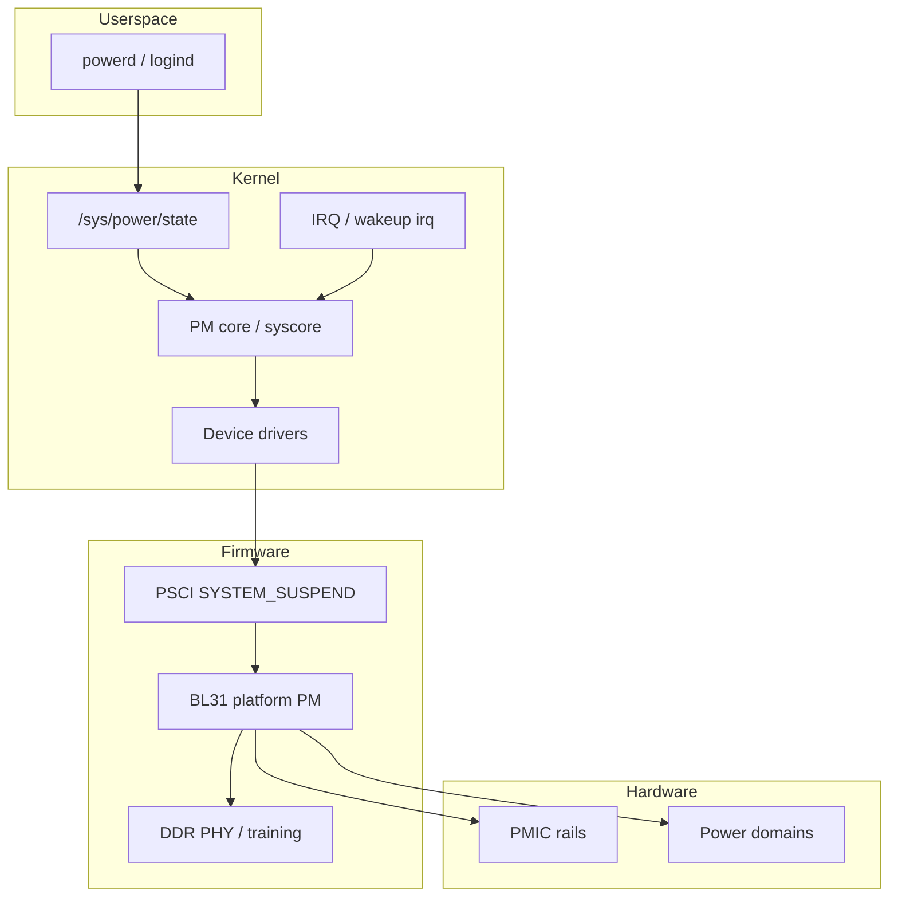

# RK3588 低功耗负责人：关注面总览

本文档面向 **SoC 原厂 / BSP 团队中负责 RK3588 低功耗的负责人**，给出职责边界、跨团队接口、KPI 建议与文档导航。技术细节按模块拆分到同目录下 `01`–`09`；典型故障见 `10_故障案例库_RK3588_zh.md`。

---

## 1. 角色职责（你要“兜底”什么）

| 层级 | 负责人典型职责 |
|------|----------------|
| **芯片规格与 errata** | 与 IC/模拟确认电源域、上电时序、唤醒约束；推动 errata 在软件侧的 workaround 与发布说明 |
| **固件契约** | BL31/TF-A、DDR 训练 blob、suspend 恢复路径与内核版本对齐矩阵 |
| **内核与驱动** | `suspend`/`resume`、`runtime PM`、电源域（PM domain）、时钟/regulator 策略、唤醒源 DT |
| **子系统** | 显示、PCIe、USB、GMAC、GPU/NPU/编解码的 idle 与系统级休眠协同 |
| **整机与 ODM** | 待机电流 KPI、唤醒源硬件设计、PMIC 原理图与 DTS 一致性评审 |
| **质量与回归** | 休眠/唤醒门禁、版本发布前的功耗与稳定性报告 |

**原因说明**：低功耗问题往往跨 **硬件 → 固件 → 内核 → 用户态策略**，单点工程师无法闭环；负责人价值在于 **定义接口、对齐版本、建立可重复的排查与回归体系**。

---

## 2. 主线内核 vs Rockchip BSP（必读）

- **Linux 主线**（如本仓库 `linux-stable`）中 RK3588 相关多为 **设备树绑定、零散驱动、电源域枚举头文件** 等；**系统级 Rockchip suspend 流程、`rockchip_suspend` 设备节点语义、部分 PMIC 序列** 通常在 **厂商 BSP 内核** 中实现。
- **文档阅读约定**：下文及姊妹篇中若出现 `rockchip_suspend`、`sleep_mode` 等，默认指 **BSP 树**；具体文件路径以你们内部分支为准，在 code review 模板中应写明仓库与 commit。

**原因说明**：照抄主线路径会在 BSP 上找不到实现，导致 DTS/驱动修改无效或排错方向错误。

**补充（避免误解）**：本仓库 **已包含** RK3588 的 **SoC `.dtsi`、OPP、通用电源域驱动、VOP2、PCIe、USB3、GPU 绑定** 等；与 BSP 的差异主要在 **板级 `rockchip_suspend` 节点、PMIC MFD（如 RK806 部分在 BSP）、厂商私有休眠路径**。姊妹篇 `01`–`09` 中凡标注 **「本仓库」** 的代码引用，均可直接在 `linux-stable` 树内打开验证。

---

## 2.5 本仓库源码索引（按主题）

| 主题 | 路径（相对于仓库根） |
|------|----------------------|
| SoC 基础与 PD 树 | `arch/arm64/boot/dts/rockchip/rk3588-base.dtsi`（`pmu` / `power-controller`） |
| CPU idle / PSCI / SCMI | 同文件 `cpus` → `idle-states`、`psci`、`firmware/scmi` |
| OPP 与电压 | `arch/arm64/boot/dts/rockchip/rk3588-opp.dtsi` |
| 通用电源域驱动 | `drivers/pmdomain/rockchip/pm-domains.c`（`rk3588_pmu`、`rk3588_pm_domains[]`） |
| Rockchip SIP（固件交互常量） | `include/soc/rockchip/rockchip_sip.h` |
| VOP2 显示 + 内部 PD 寄存器 | `drivers/gpu/drm/rockchip/rockchip_drm_vop2.c` |
| SPI 休眠与 runtime PM | `drivers/spi/spi-rockchip.c` |
| 电源域绑定头 | `include/dt-bindings/power/rk3588-power.h` |

---

## 3. 文档地图（按模块）

| 文档 | 内容 |
|------|------|
| [01_SoC电源域与硬件架构_zh.md](01_SoC电源域与硬件架构_zh.md) | 电源域 ID、电压域映射、关电顺序与硬件依赖 |
| [02_固件与信任链_BL31_DDR_zh.md](02_固件与信任链_BL31_DDR_zh.md) | PSCI、DDR 自刷新、BL31 与休眠契约 |
| [03_内核系统休眠与唤醒源_zh.md](03_内核系统休眠与唤醒源_zh.md) | `/sys/power`、唤醒源、DT、`rockchip_suspend`（BSP） |
| [04_CPUFreq_CPUIdle_PSCI_调度_zh.md](04_CPUFreq_CPUIdle_PSCI_调度_zh.md) | big.LITTLE、idle、调度与 thermal |
| [05_DDR_PMIC_Regulator_zh.md](05_DDR_PMIC_Regulator_zh.md) | PMIC、rail、regulator 与 suspend 前后策略 |
| [06_显示子系统_VOP_DP_MIPI_zh.md](06_显示子系统_VOP_DP_MIPI_zh.md) | resume 显示恢复、黑屏类问题 |
| [07_高速外设_PCIe_USB_GMAC_zh.md](07_高速外设_PCIe_USB_GMAC_zh.md) | runtime PM、ASPM、阻止 suspend |
| [08_多媒体_GPU_NPU_编解码_zh.md](08_多媒体_GPU_NPU_编解码_zh.md) | 加速器 PD、fence、PM 失败恢复 |
| [09_现场测量与日志方法论_zh.md](09_现场测量与日志方法论_zh.md) | 电流、日志、pm_test、ftrace |
| [10_故障案例库_RK3588_zh.md](10_故障案例库_RK3588_zh.md) | 现象—手段—分析—处理—回归 |

---

## 4. 系统休眠数据流（概念图）

下列示意图用于对齐 **软件分层** 与 **排错时先猜哪一层**（节点命名仅为概念，非具体驱动名）。

**原因说明**：无法唤醒时，日志可能停在 kernel 或固件侧；负责人需快速判断是 **唤醒源未触发**、**BL31/DDR 恢复失败** 还是 **驱动 resume 死锁**。

---

## 5. 跨团队接口清单

| 对接方 | 典型议题 | 交付物 |
|--------|----------|--------|
| IC / 架构 | PD 依赖、唤醒 pin、漏电 spec | 硬件手册章节、errata |
| 模拟 / PMIC | 时序、DVS、待机 LDO | 原理图评审记录、PMIC 寄存器手册 |
| 固件 | BL31 版本、DDR blob、PSCI 能力 | Release note、兼容性矩阵 |
| 内核驱动各 owner | `suspend_noirq` 顺序、runtime PM | 合入 checklist、回归用例 |
| ODM | 按键/RTC/USB 唤醒、外设漏电 | DTS 变更单、实测电流 |

---

## 6. KPI 与门禁建议（可按产品裁剪）

- **功能**：`suspend to RAM` 成功率（如连续 N 次无 hang）、唤醒源覆盖（电源键 / RTC / 指定 GPIO / 网卡 WoL 等）。
- **功耗**：亮屏 idle、关屏 idle、`suspend` 后底板 + SoC 分工电流（若可测）。
- **稳定性**：长时间 `suspend`/`resume` 循环；压力场景（播放/下载后休眠）。
- **回归门禁**：每个 **内核小版本 + BL31/DDR blob 变更** 至少跑一轮标准休眠用例。

---

## 7. 负责人周常检查项（简表）

1. 本周是否有 **固件或内核** 单独升级而未更新兼容性矩阵？  
2. 新客户 DTS 是否评审 **唤醒源** 与 **regulator 名称** 与原理图一致？  
3. 未关闭的 **suspend 相关 issue** 是否已分类（固件 / 驱动 / 硬件）？  
4. 是否存在 **高待机电流** 单点，是否已映射到 rail 或 PD？

---

## 8. 延伸阅读（本仓库）

- 通用 Linux 电源管理历史与 suspend 路径可参考：[../01_2010-2012_clock_dvfs_suspend_code_walkthrough_zh.md](../01_2010-2012_clock_dvfs_suspend_code_walkthrough_zh.md)（注意与 RK3588 BSP 区分语境）。
