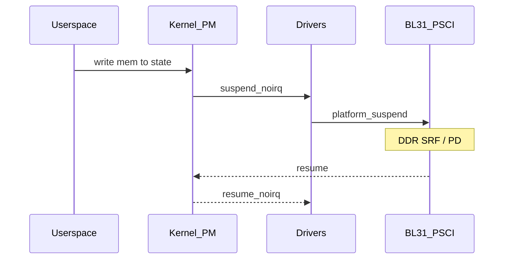

# RK3588：内核系统休眠与唤醒源

## 1. 文档目的

梳理 **Linux 系统休眠**（`suspend to RAM` 等）在 **内核通用框架** 下的行为，以及 **RK3588 BSP** 上常见的 **Rockchip 扩展**（如 `rockchip_suspend` 设备树节点）与 **唤醒源** 配置要点。

**原因**：唤醒失败、进不了睡，多数最终在 **内核 PM 回调** 或 **DT 唤醒描述** 上落地；负责人需能把问题从「现象」映射到 **子系统与配置项**。

---

## 2. 用户可见接口

- **`/sys/power/state`**：写入 `mem`（STR）、`freeze`（冻结用户态）、`disk`（休眠到盘，若支持）等。  
- **`/sys/power/pm_test`**：若编译开启，用于 **分级测试**（见 `09`）。  
- **`/sys/power/wake_lock`**（Android 风格内核）或 **用户态 logind**：桌面产品常经 **上层策略** 调用内核。

**负责人关注点**：产品是否 **禁用** `hibernate`、是否允许 **s2idle** vs **deep**，与 **固件能力** 必须一致。

---

## 3. 内核 suspend 流程（本仓库：`kernel/power/suspend.c`）

用户态 **`echo mem > /sys/power/state`** 最终进入 **`enter_state()`** → **`suspend_devices_and_enter()`**。核心顺序如下（与内核版本基本一致）：

```494:524:kernel/power/suspend.c
int suspend_devices_and_enter(suspend_state_t state)
{
	int error;
	bool wakeup = false;

	if (!sleep_state_supported(state))
		return -ENOSYS;

	pm_suspend_target_state = state;

	if (state == PM_SUSPEND_TO_IDLE)
		pm_set_suspend_no_platform();

	error = platform_suspend_begin(state);
	if (error)
		goto Close;

	console_suspend_all();
	suspend_test_start();
	error = dpm_suspend_start(PMSG_SUSPEND);
	if (error) {
		pr_err("Some devices failed to suspend, or early wake event detected\n");
		goto Recover_platform;
	}
	suspend_test_finish("suspend devices");
	if (suspend_test(TEST_DEVICES))
		goto Recover_platform;

	do {
		error = suspend_enter(state, &wakeup);
	} while (!error && !wakeup && platform_suspend_again(state));
```

**`suspend_enter()`** 内依次 **`dpm_suspend_late` → `dpm_suspend_noirq` → `syscore_suspend` → `suspend_ops->enter()`**（RK3588 上为 **PSCI SYSTEM_SUSPEND**，见 `02` 节）：

```409:458:kernel/power/suspend.c
static int suspend_enter(suspend_state_t state, bool *wakeup)
{
	int error;

	error = platform_suspend_prepare(state);
	if (error)
		goto Platform_finish;

	error = dpm_suspend_late(PMSG_SUSPEND);
	...
	error = dpm_suspend_noirq(PMSG_SUSPEND);
	...
	error = platform_suspend_prepare_noirq(state);
	...
	if (state == PM_SUSPEND_TO_IDLE) {
		s2idle_loop();
		goto Platform_wake;
	}

	error = pm_sleep_disable_secondary_cpus();
	...
	arch_suspend_disable_irqs();
	BUG_ON(!irqs_disabled());

	system_state = SYSTEM_SUSPEND;

	error = syscore_suspend();
	if (!error) {
		*wakeup = pm_wakeup_pending();
		if (!(suspend_test(TEST_CORE) || *wakeup)) {
			...
			error = suspend_ops->enter(state);
```

**原因**：驱动 bug 常暴露在 **`dpm_suspend_*`** 某一阶段；**`pm_wakeup_pending()`** 为真时会 **跳过 `suspend_ops->enter`**，表现为 **看似没睡深或立刻返回**（配合 `wakeup_sources` 调试，见 `09`）。

---

## 4. 唤醒源（Wake sources）

### 4.1 内核侧

- **IRQ 唤醒**：设备驱动 `enable_irq_wake()`，DT 中常配合 `wakeup-source`。  
- **RTC**：`rtcwake`、`/sys/class/rtc/rtc0/wakealarm`。  
- **GPIO**：按键、翻盖等，需 **极性、debounce** 与硬件一致。

### 4.2 调试

- **`/sys/kernel/debug/wakeup_sources`**：查看谁持有唤醒锁或导致 **abort suspend**（内核版本不同字段略有差异）。  
- **`/proc/interrupts`**：对比 suspend 前后计数。

**原因**：误配 `wakeup-source` 会导致 **秒醒**（`10` **附录 B** 秒醒条目）。

---

## 5. BSP：`rockchip_suspend` 与 sleep mode（占位说明）

厂商树中常见 **`rockchip_suspend` 节点**，用于描述 **SoC 支持的休眠模式、唤醒 GPIO 组、PMIC 协同** 等（具体属性名以内部分支 DTS 绑定为准）。

**负责人动作**：

- 在内部 wiki 维护 **「属性字典」**：每个属性的 **硬件含义** 与 **禁止组合**。  
- 新客户 DTS **必须从参考设计 diff**，禁止复制其他板型 PMIC 段。

**原因**：社区曾讨论 **PMIC 段配置错误** 导致待机/唤醒异常（例如 Orange Pi 相关 issue，见 `10` 与发行版 release note）。

---

## 6. Device Tree 检查清单（唤醒与休眠）

- 电源键：`pwrkey` / `gpio-keys` / PMIC **中断** 是否声明为唤醒。  
- USB：**remote wakeup** 需求与产品定义一致。  
- 网卡：**WoL** 与 PHY 设计。  
- **串口调试**：是否需在休眠时保持供电（影响漏电，但与「能否调试」权衡）。

---

## 7. 与电源域、固件的关系

- 内核 **冻结任务** 后，部分 **PD** 仍可能由 **genpd + 驱动** 管理；最终 **深睡** 常由 **固件** 统一处理 DDR/大域（见 `01`、`02`）。



---

## 8. 常见坑

- **驱动返回 -EBUSY** 导致 suspend abort，用户态却误以为「已睡」。  
- **IRQ wake** 未 enable，按键硬件有但 **无法唤醒**。  
- **多个设备共用一个唤醒 GPIO**，冲突未处理。

---

## 9. 负责人交付物

- 《DTS 休眠/唤醒 review checklist》。  
- 每版 BSP **suspend 回归报告**（成功率、失败驱动列表）。  
- 对 ODM 发布 **《唤醒源硬件设计指南》**（上拉/下拉、ESD、毛刺）。
