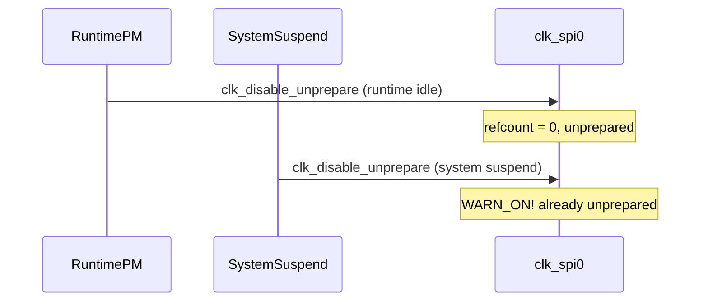
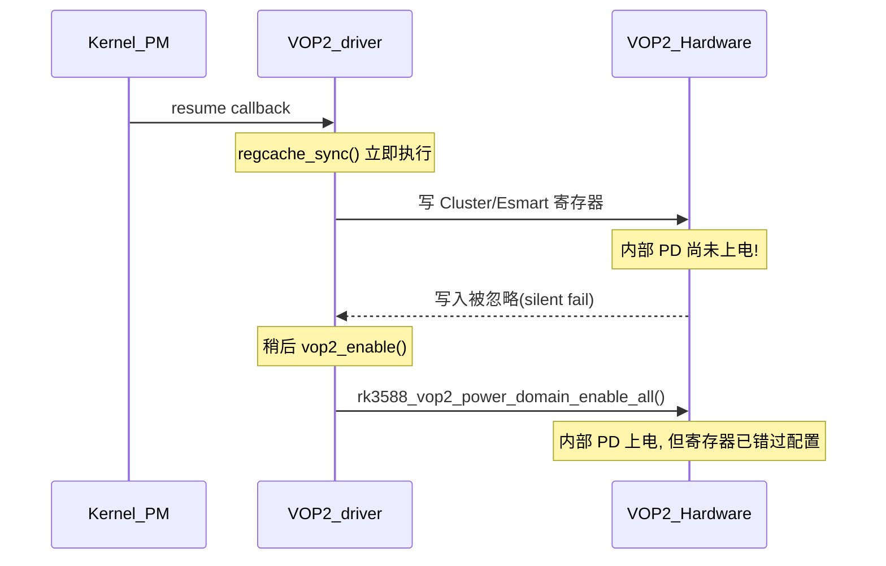
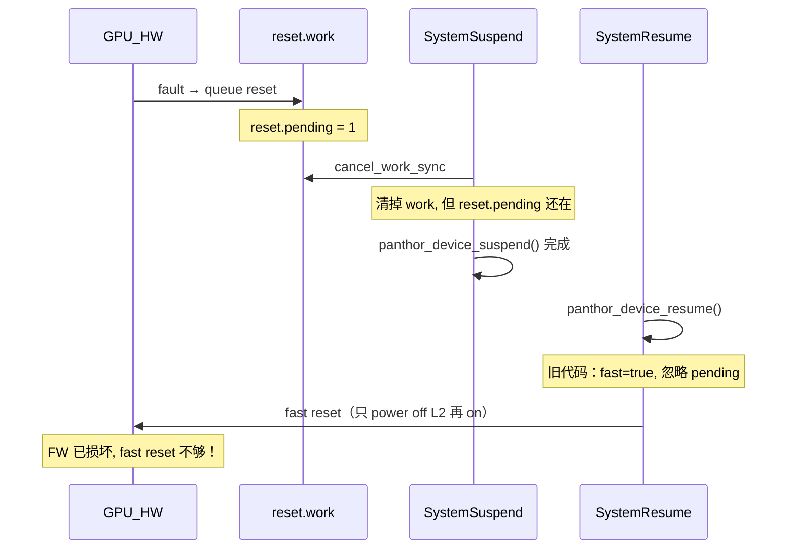

# RK3588 驱动级低功耗故障深度分析

本文对 **三个在公开社区/内核中可追溯的低功耗驱动级故障** 做全路径拆解：**故障现象 → 排查手段 → 分析方法 → 根因 → 修复 → 延伸**。

所有代码引用均基于 **本仓库 `linux-stable`（v6.15.x 树）**，可直接对照。

---

## 故障一：`spi-rockchip` 系统休眠与 runtime PM「双重关钟」触发 `WARN_ON`

### 1.1 出处

- Rockchip 工程师 Jon Lin 的上游补丁：[spi: rockchip: Avoid redundant clock disable in pm operation](https://patchew.org/linux/20240824051452.3954878-1-jon.lin@rock-chips.com/)
- 补丁邮件中贴出了 **RK3588 EVB1 LP4 V10** 上的 `WARN_ON` 栈。

### 1.2 故障现象

**dmesg 核心报错**（来自补丁邮件）：

```
[   22.869352][ T1885] clk_spi0 already unprepared
[   22.869379][ T1885] WARNING: CPU: 3 PID: 1885 at drivers/clk/clk.c:813 clk_core_unprepare+0xbc
[   22.869393][ T1885] Hardware name: Rockchip RK3588 EVB1 LP4 V10 Board (DT)
[   22.869401][ T1885] pc : clk_core_unprepare+0xbc/0x214
```

**关键信号**：`clk_spi0 already unprepared` — 时钟已经被 unprepare 过一次，**第二次 `clk_disable_unprepare()` 触发 `WARN_ON`**。

**用户可见影响**：内核日志刷 WARNING；若 `panic_on_warn=1` 或后续路径依赖时钟状态，可能 **导致 suspend 失败或 SPI 外设 resume 后不可用**。

### 1.3 排查手段

1. **dmesg 关键词过滤**：

   ```bash
   dmesg | grep -E 'already unprepared|clk_core_unprepare|WARNING.*clk'
   ```

   若能看到 **`clk_spiN already unprepared`** + **调用栈中含 `rockchip_spi_suspend`**，即可确认命中此问题。

2. **确认 runtime PM 状态**（suspend 前）：

   ```bash
   cat /sys/bus/platform/devices/feXX0000.spi/power/runtime_status
   ```

   若显示 **`suspended`**（runtime PM 已经把设备挂起过），则 system suspend 路径上 **不应再关一次钟**。

3. **`pm_ops` 注册方式确认**：看驱动代码中 `dev_pm_ops` 是 **`SET_NOIRQ_SYSTEM_SLEEP_PM_OPS`** 还是 **`SET_SYSTEM_SLEEP_PM_OPS`**，以及是否同时注册了 **`SET_RUNTIME_PM_OPS`**。

### 1.4 分析方法

**核心矛盾**：同一份时钟由 **两条独立路径** 分别管控：

- **路径 A** — runtime PM：`rockchip_spi_runtime_suspend()` 调用 `clk_disable_unprepare(spiclk)` 和 `clk_disable_unprepare(apb_pclk)`。
- **路径 B** — system sleep：`rockchip_spi_suspend()` **也**调用这两个 `clk_disable_unprepare()`（在旧版代码中直接调用；当前主线已改为 `pm_runtime_force_suspend`）。

**触发条件**：SPI 控制器 **idle 时间较长 → runtime PM 已将其置为 suspended → 时钟已 unprepare**。此时 **system suspend 触发** → 执行 `rockchip_spi_suspend()` → **再次对已 unprepare 的时钟调 `clk_disable_unprepare()`** → `WARN_ON`。

**时序图**：



### 1.5 根因定位

**旧版驱动** 的 `rockchip_spi_suspend()` **无视 runtime PM 状态**，直接操作时钟——与 `rockchip_spi_runtime_suspend()` 的操作 **完全重复**。两套回调同时注册在同一个 `dev_pm_ops` 里：

```1018:1022:drivers/spi/spi-rockchip.c
static const struct dev_pm_ops rockchip_spi_pm = {
	SET_NOIRQ_SYSTEM_SLEEP_PM_OPS(rockchip_spi_suspend, rockchip_spi_resume)
	SET_RUNTIME_PM_OPS(rockchip_spi_runtime_suspend,
			   rockchip_spi_runtime_resume, NULL)
};
```

### 1.6 修复方案（当前主线已包含）

本仓库中的 **当前版本** 使用 **`pm_runtime_force_suspend()`** / **`pm_runtime_force_resume()`** 将 system sleep 操作 **委托** 给 runtime PM 框架——框架内部会 **检查设备是否已经 suspended**，避免重复操作：

```952:985:drivers/spi/spi-rockchip.c
static int rockchip_spi_suspend(struct device *dev)
{
	int ret;
	struct spi_controller *ctlr = dev_get_drvdata(dev);

	ret = spi_controller_suspend(ctlr);
	if (ret < 0)
		return ret;

	ret = pm_runtime_force_suspend(dev);
	if (ret < 0) {
		spi_controller_resume(ctlr);
		return ret;
	}

	pinctrl_pm_select_sleep_state(dev);

	return 0;
}

static int rockchip_spi_resume(struct device *dev)
{
	int ret;
	struct spi_controller *ctlr = dev_get_drvdata(dev);

	pinctrl_pm_select_default_state(dev);

	ret = pm_runtime_force_resume(dev);
	if (ret < 0)
		return ret;

	return spi_controller_resume(ctlr);
}
```

**`pm_runtime_force_suspend()`** 内部逻辑（简述）：若设备 **已处于 `RPM_SUSPENDED`** 则 **跳过** 实际回调；否则才执行 `runtime_suspend` 回调。这样 **无论设备当前是否已 runtime suspended，都不会二次 unprepare**。

### 1.7 延伸：审计其它 Rockchip 驱动

RK3588 外设多（I2C、UART、PWM、TSADC 等），任何同时注册 **runtime PM + system sleep PM** 的驱动，若在 system sleep 回调里 **直接操作时钟/复位** 而不检查 `pm_runtime_status_suspended()`，都可能踩同一个坑。审计方法：

```bash
grep -rn 'clk_disable_unprepare' drivers/xxx/rockchip*.c
```

对比对应 **`_suspend`** 回调是否通过 **`pm_runtime_force_suspend`** 委托。

---

## 故障二：`drm/rockchip` VOP2 —— `regcache_sync()` 在 resume 时写入已关电的内部域

### 2.1 出处

本仓库内已合入的提交链：

- **`afa965a45e01`**（第一版修复）：`drm/rockchip: vop2: fix suspend/resume` — 使用 `regmap_reinit_cache()` 方式。
- **`b63a553e8f5a`**（跟进"改良"）：`drm/rockchip: vop2: Use regcache_sync() to fix suspend/resume` — 将 reinit_cache 换成 regcache_sync，认为更正规。
- **`81a06f1d02e5`**（Revert，本仓库当前生效的）：**Revert 上述改良**，因为 **RK3588 上行不通**。

### 2.2 故障现象

合入 `b63a553e8f5a` 后在 **RK3588** 上执行 **`suspend` → `resume`** 后出现 **显示异常**（黑屏、花屏、模式错误等，具体依拓扑与分辨率而异）。

**关键日志线索**（不一定每次出现，但可辅助判断）：

- VOP2 版本检查通过（说明 SoC genpd 层面已上电），但 **窗口输出内容不正确**。
- 在 **多 VP（Video Port）+ Cluster window** 场景下更容易复现。

### 2.3 排查手段

1. **对比实验：bisect 到 VOP2 suspend/resume 相关提交**：

   ```bash
   git log --oneline -- drivers/gpu/drm/rockchip/rockchip_drm_vop2.c | grep -i 'suspend\|resume\|regcache'
   ```

   在本仓库可看到 `81a06f1d02e5`（Revert）。

2. **dmesg 搜索 DRM 错误**：

   ```bash
   dmesg | grep -iE 'vop2|rockchip.*drm|failed.*modeset'
   ```

3. **强制 modeset 验证**：`resume` 后执行 `chvt 1 && chvt 7`（或类似切换），若画面恢复说明 **是寄存器内容被破坏而非链路物理故障**。

4. **关闭指定 Cluster window 做 A/B**：若仅使用 **Esmart/Smart** 窗口不出问题，而启用 **Cluster** 时出问题，则指向 **Cluster 内部 PD 相关寄存器**。

### 2.4 分析方法

**硬件背景**：RK3588 VOP2 **内部** 有独立的 **电源域控制寄存器** `RK3588_SYS_PD_CTRL`，控制 **4 个 Cluster window** 和 **Esmart** 子模块的供电。**只有当这些内部 PD 上电后，对应的寄存器区域才可写入**。

本仓库里 `vop2_enable()` 在检测到 RK3588 时会 **显式调用** `rk3588_vop2_power_domain_enable_all()` 上电这些子域：

```807:816:drivers/gpu/drm/rockchip/rockchip_drm_vop2.c
static void rk3588_vop2_power_domain_enable_all(struct vop2 *vop2)
{
	u32 pd;

	pd = vop2_readl(vop2, RK3588_SYS_PD_CTRL);
	pd &= ~(VOP2_PD_CLUSTER0 | VOP2_PD_CLUSTER1 | VOP2_PD_CLUSTER2 |
		VOP2_PD_CLUSTER3 | VOP2_PD_ESMART);

	vop2_writel(vop2, RK3588_SYS_PD_CTRL, pd);
}
```

**`regcache_sync()` 出问题的原因**：



`regcache_sync()` 在 **resume 非常早期** 就把缓存中的寄存器值 **推到硬件**——但此时 **Cluster/Esmart 内部 PD 还没上电**，写入 **被硬件丢弃**。等到后来 `vop2_enable()` 真正上电时，这些寄存器保持 **默认/未定义** 状态。

**对比**：`regmap_reinit_cache()`（第一版修复）不会在 resume 时写硬件，只是 **清空缓存** 并让后续正常 `vop2_enable()` 流程负责配置 — 这个顺序与 **硬件上电时序一致**。

### 2.5 当前仓库的修复（Revert 后的状态）

Revert 提交 `81a06f1d02e5` 的 commit message 说得很清楚：

> regcache_sync will try to reload the configuration in regcache to hardware, but the registers of 4 Cluster windows and Esmart1/2/3 on the upcoming rk3588 can not be set successfully before internal PD power on.
>
> Also it's better to keep the hardware register as it is before we really enable it.

当前 `vop2_disable()` 使用 **`regcache_drop_region()`** 丢弃缓存，而非 `regcache_mark_dirty()`：

```876:887:drivers/gpu/drm/rockchip/rockchip_drm_vop2.c
static void vop2_disable(struct vop2 *vop2)
{
	rockchip_drm_dma_detach_device(vop2->drm, vop2->dev);

	pm_runtime_put_sync(vop2->dev);

	regcache_drop_region(vop2->map, 0, vop2_regmap_config.max_register);

	clk_disable_unprepare(vop2->pclk);
	clk_disable_unprepare(vop2->aclk);
	clk_disable_unprepare(vop2->hclk);
}
```

**效果**：resume → `vop2_enable()` 时 **不会** 有陈旧缓存被推到硬件；正常的 atomic commit 流程会在 **内部 PD 上电后** 重新配置所有窗口寄存器。

### 2.6 延伸：对「regmap 缓存 + 内部多级 PD」的通用教训

任何 SoC IP 若 **内部** 含多级电源域（如 GPU、ISP、NPU 等），**regcache 同步** 必须与 **内部 PD 上电顺序** 对齐。审计方法：

- 检查驱动是否在 `resume` 阶段使用 `regcache_sync()` 或 `regcache_mark_dirty()` + 后续 `sync`。
- 确认对应的 **硬件寄存器区域** 在 sync 时刻是否已经 **可写**。

---

## 故障三：`drm/panthor`（Mali CSF GPU）— suspend/resume 失败后状态机损坏

### 3.1 出处

本仓库已包含的补丁链（**均针对 `drivers/gpu/drm/panthor/`**）：

- **`ec62d37d2c0d`**：`Fix the fast-reset logic` — soft reset 后不能再走 fast reset；慢 reset fallback 需要在正确位置执行。
- **`8d70fa5d83c7`**（backport 自 `57e233c3bd63`）：`Fix a race between the reset and suspend path` — 挂起时若有 pending reset，resume 仍尝试 fast reset，可能导致 FW **部分功能异常**。
- **`73bdbf12fbd4`**：`Call panthor_gpu_coherency_init() after PM resume()` — 在时钟/PD 未 enable 时读 GPU 寄存器导致读回错误。

### 3.2 故障现象

**场景一**：GPU 负载中 → `system suspend` → `resume` 后 **GPU 作业超时或 hang**。

**场景二**：GPU 发生过一次 **reset**（例如 TDR） → 紧接着 `suspend` → `resume` 后 **MCU 固件无法启动**，日志出现：

```
drm/panthor: Failed to boot MCU after reset, making device unusable.
```

设备被标为 **unusable**（`panthor_device_unplug`），后续任何 GPU 操作直接失败。

**场景三**：coherent 模式下 resume，在时钟还没 enable 时读 `GPU_COHERENCY_FEATURES` 寄存器返回错误值 → coherency 初始化失败 → 后续 DMA coherency 错误。

### 3.3 排查手段

1. **dmesg 搜索 Panthor 错误**：

   ```bash
   dmesg | grep -iE 'panthor|MCU.*boot|reset.*pending|fast.reset'
   ```

2. **runtime PM 状态**：

   ```bash
   cat /sys/bus/platform/devices/fb000000.gpu/power/runtime_status
   ```

3. **确认是否有 pending reset**：查看 `dmesg` 中是否有 **`Fast reset failed, trying a slow reset`** 这条日志 — 若出现说明 fast reset 确实失败了。

4. **压力复现**：用 GPU benchmark（如 `glmark2-es2`）跑到 TDR 触发 → 立即执行 `echo mem > /sys/power/state` → 观察 `resume` 后 GPU 状态。

### 3.4 分析方法

Panthor 驱动维护一个 **显式的 PM 状态机**：

```
PANTHOR_DEVICE_PM_STATE_ACTIVE
    ↓ suspend
PANTHOR_DEVICE_PM_STATE_SUSPENDING
    ↓
PANTHOR_DEVICE_PM_STATE_SUSPENDED
    ↓ resume
PANTHOR_DEVICE_PM_STATE_RESUMING
    ↓
PANTHOR_DEVICE_PM_STATE_ACTIVE
```

**同时** 还有一个 **reset 工作队列**（`ptdev->reset.work`），在 GPU fault 时异步排队：

**竞态一（reset vs suspend）**：



**问题**：`cancel_work_sync` 阻止了 **reset work 的执行**，但 **reset 的原因（FW 状态损坏）** 并未消失。resume 时若仍走 **fast reset**（只关闭/重启 L2），**FW 依旧处于异常状态**。

修复 `8d70fa5d83c7` 在 resume 时检查 `reset.pending`：若有 pending reset，**强制 `fast = false`**：

```477:483:drivers/gpu/drm/panthor/panthor_device.c
		if (atomic_read(&ptdev->reset.pending)) {
			ptdev->reset.fast = false;
			atomic_set(&ptdev->reset.pending, 0);
		}
```

**竞态二（fast reset 逻辑本身有误）**：

`panthor_device_resume()` 中的 **两级尝试**：

```485:489:drivers/gpu/drm/panthor/panthor_device.c
		ret = panthor_device_resume_hw_components(ptdev);
		if (ret && ptdev->reset.fast) {
			drm_err(&ptdev->base, "Fast reset failed, trying a slow reset");
			ptdev->reset.fast = false;
			ret = panthor_device_resume_hw_components(ptdev);
```

修复 `ec62d37d2c0d` 确保 **fast → slow fallback 之间执行了 `panthor_gpu_soft_reset()`**（代码在更早版本可能缺失这一步，导致 MCU 状态不被真正重置）。

### 3.5 suspend 与 resume 的完整路径（本仓库）

**suspend**：

```529:570:drivers/gpu/drm/panthor/panthor_device.c
int panthor_device_suspend(struct device *dev)
{
	struct panthor_device *ptdev = dev_get_drvdata(dev);
	...
	/* 清除 MMIO 映射, 防止用户态访问已关电硬件 */
	atomic_set(&ptdev->pm.state, PANTHOR_DEVICE_PM_STATE_SUSPENDING);
	unmap_mapping_range(...);
	...
	if (panthor_device_is_initialized(ptdev) ...) {
		cancel_work_sync(&ptdev->reset.work);

		/* 按 "假装在做 reset" 的顺序关闭子系统 */
		panthor_sched_suspend(ptdev);
		panthor_fw_suspend(ptdev);
		panthor_mmu_suspend(ptdev);
		panthor_gpu_suspend(ptdev);
	}

	panthor_devfreq_suspend(ptdev);
	clk_disable_unprepare(ptdev->clks.coregroup);
	clk_disable_unprepare(ptdev->clks.stacks);
	clk_disable_unprepare(ptdev->clks.core);
	atomic_set(&ptdev->pm.state, PANTHOR_DEVICE_PM_STATE_SUSPENDED);
	return 0;
}
```

**resume**：

```451:527:drivers/gpu/drm/panthor/panthor_device.c
int panthor_device_resume(struct device *dev)
{
	...
	/* 恢复时钟 */
	clk_prepare_enable(ptdev->clks.core);
	clk_prepare_enable(ptdev->clks.stacks);
	clk_prepare_enable(ptdev->clks.coregroup);
	panthor_devfreq_resume(ptdev);

	if (panthor_device_is_initialized(ptdev) ...) {
		/* 若有 pending reset → 强制 slow */
		if (atomic_read(&ptdev->reset.pending)) {
			ptdev->reset.fast = false;
			atomic_set(&ptdev->reset.pending, 0);
		}

		ret = panthor_device_resume_hw_components(ptdev);
		if (ret && ptdev->reset.fast) {
			drm_err(&ptdev->base, "Fast reset failed, trying a slow reset");
			ptdev->reset.fast = false;
			ret = panthor_device_resume_hw_components(ptdev);
		}

		if (!ret)
			panthor_sched_resume(ptdev);
		...
	}
	...
}
```

**`panthor_device_resume_hw_components()`** 按 **GPU → MMU → FW** 恢复：

```435:449:drivers/gpu/drm/panthor/panthor_device.c
static int panthor_device_resume_hw_components(struct panthor_device *ptdev)
{
	int ret;

	panthor_gpu_resume(ptdev);
	panthor_mmu_resume(ptdev);

	ret = panthor_fw_resume(ptdev);
	if (!ret)
		return 0;

	panthor_mmu_suspend(ptdev);
	panthor_gpu_suspend(ptdev);
	return ret;
}
```

### 3.6 **reset work** 内部流程（对比理解）

非 suspend 场景下 GPU fault 触发的 reset：

```126:155:drivers/gpu/drm/panthor/panthor_device.c
static void panthor_device_reset_work(struct work_struct *work)
{
	struct panthor_device *ptdev = container_of(work, struct panthor_device, reset.work);
	int ret = 0, cookie;

	/* 若正在 suspend 则跳过, resume 时会处理 */
	if (atomic_read(&ptdev->pm.state) != PANTHOR_DEVICE_PM_STATE_ACTIVE)
		return;

	if (!drm_dev_enter(&ptdev->base, &cookie))
		return;

	panthor_sched_pre_reset(ptdev);
	panthor_fw_pre_reset(ptdev, true);
	panthor_mmu_pre_reset(ptdev);
	panthor_gpu_soft_reset(ptdev);
	panthor_gpu_l2_power_on(ptdev);
	panthor_mmu_post_reset(ptdev);
	ret = panthor_fw_post_reset(ptdev);
	atomic_set(&ptdev->reset.pending, 0);
	panthor_sched_post_reset(ptdev, ret != 0);
	drm_dev_exit(cookie);

	if (ret) {
		panthor_device_unplug(ptdev);
		drm_err(&ptdev->base, "Failed to boot MCU after reset, making device unusable.");
	}
}
```

**核心对照**：reset work 里 **一定** 会走 `panthor_gpu_soft_reset()` + `panthor_fw_post_reset()`（相当于 slow reset）；而 resume 时 **fast=true** 会跳过 soft reset —— 若此时 FW 已损坏，fast reset 自然不够。

### 3.7 延伸：对 RK3588 GPU/NPU 的启示

- RK3588 上 GPU 节点为 `compatible = "rockchip,rk3588-mali", "arm,mali-valhall-csf"`。若内核 config 启用 **`CONFIG_DRM_PANTHOR`**，则上述分析 **直接适用**。
- 若仍使用 **panfrost** 或 **厂商闭源栈**，同样应检查 **suspend 失败后是否有「reset + FW reload」恢复路径**，不能假设「下次 resume 自动好」。
- **NPU** 等其它带 **MCU/FW** 的 IP 也适用同一模式：**PM 失败 → 必须有定义清晰的「恢复到已知好状态」路径**。

---

## 总结对照表

| 维度 | 故障一（SPI 双 PM） | 故障二（VOP2 regcache） | 故障三（Panthor reset） |
|------|---------------------|------------------------|------------------------|
| **故障类型** | 框架使用错误 | 硬件时序与框架假设不匹配 | 状态机竞态 |
| **触发条件** | runtime PM 已 suspended + system suspend | resume 时 regcache_sync 早于内部 PD 上电 | pending reset + suspend/resume |
| **dmesg 关键词** | `already unprepared` | 无明显 error，但画面异常 | `Failed to boot MCU` |
| **修复模式** | **委托**: system sleep 通过 `pm_runtime_force_suspend/resume` | **顺序**: 不在 resume 早期推缓存，让业务路径配置 | **状态感知**: resume 检查 pending reset, 强制 slow |
| **审计推广** | 所有同时注册两种 PM 的驱动 | 所有用 regcache + 内部 PD 的 IP | 所有带 FW/MCU + reset work 的 IP |
| **本仓库对应文件** | `drivers/spi/spi-rockchip.c` | `drivers/gpu/drm/rockchip/rockchip_drm_vop2.c` | `drivers/gpu/drm/panthor/panthor_device.c` |
