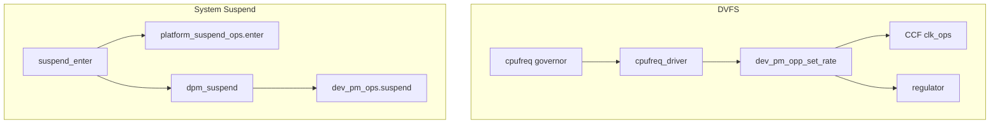

# 2010–2012 时钟 / DVFS / Suspend — 内核驱动层

## 技术背景与演进脉络

智能手机 SoC 从功能机时代走向 Android 2.x 时代时，**动态功耗**与**漏电**同时成为瓶颈。软件上需要：

1. **统一时钟抽象**：避免每个 IP 各自实现 gate/mux/divider，便于 DVFS 与 suspend 协同。
2. **CPU 频率与电压联动**：从固定表驱动到与 **OPP（Operating Performance Points）**、**regulator** 协作。
3. **系统级休眠**：`S2RAM`/`standby` 路径上冻结任务、遍历设备 `dev_pm_ops`，并与平台 `platform_suspend_ops` 对接。

**为何这三条线常一起出现**：调频改变活跃功耗，时钟门控与 runtime suspend 降低空闲漏电；系统 suspend 要求所有子系统在同一套 PM 契约下可逆地停机。任一子系统「各写各的」都会导致睡不下去或唤醒后时钟/频点不一致。

> 本仓库为较新主线（如 v6.15.x）；下列路径是**同源演进**后的现名，与 2.6.3x/3.x 时代目录可能不同，但子系统语义一致。

## 内核代码地图

### Common Clock Framework (CCF)

| 路径 | 职责（读代码时关注什么） |
|------|--------------------------|
| `drivers/clk/clk.c` | CCF 核心：注册、`prepare`/`enable` 引用计数、速率传播、notifier（`PRE_RATE_CHANGE` 等） |
| `include/linux/clk-provider.h` | Provider：`struct clk_ops`、`struct clk_hw`、`clk_register_*` |
| `include/linux/clk.h` | Consumer：`devm_clk_get`、`clk_prepare_enable`、`clk_set_rate` |
| `drivers/clk/clk-gate.c` | 门控时钟 helper（典型省电手段） |
| `drivers/clk/clk-divider.c` / `clk-mux.c` / `clk-composite.c` | 分频、选择、组合节点 |
| `include/linux/of_clk.h` | DT 绑定：`of_clk_get` 等 |
| `Documentation/devicetree/bindings/clock/` | 各 SoC 时钟绑定（理解硬件描述入口） |

### DVFS：cpufreq + OPP + regulator

| 路径 | 职责 |
|------|------|
| `drivers/cpufreq/cpufreq.c` | cpufreq 子系统：`cpufreq_policy`、与 suspend 协同、governor 框架 |
| `include/linux/cpufreq.h` | `struct cpufreq_policy`、`struct cpufreq_driver`、`struct cpufreq_governor` |
| `drivers/cpufreq/cpufreq_ondemand.c` | ondemand（采样负载调频，该时期代表性 governor） |
| `drivers/cpufreq/cpufreq_conservative.c` | conservative（更保守升频） |
| `drivers/cpufreq/cpufreq-dt.c` | **DT + OPP 通用路径**：`dev_pm_opp_set_rate` 协调 clock 与电压 |
| `drivers/cpufreq/cpufreq-dt-platdev.c` | 从 DT 注册 `cpufreq-dt` 平台设备 |
| `drivers/opp/core.c` | OPP 表、启用/禁用、切频切压 |
| `drivers/opp/of.c` | 解析 `operating-points-v2` 等 |
| `include/linux/pm_opp.h` | `dev_pm_opp_set_rate`、`dev_pm_opp_find_freq_*` 等 API |

### Suspend / Resume 与设备电源

| 路径 | 职责 |
|------|------|
| `kernel/power/suspend.c` | `mem_sleep` 状态机、`platform_suspend_ops` 调用序列 |
| `include/linux/suspend.h` | `struct platform_suspend_ops`：`prepare`/`enter`/`finish` 等 |
| `include/linux/pm.h` | `struct dev_pm_ops`：`suspend`/`resume`/`suspend_noirq`、**runtime_suspend** |
| `kernel/power/main.c` / `process.c` / `autosleep.c` | sysfs 入口、进程冻结、`autosleep` |
| `drivers/base/power/main.c` | 设备 DPM 顺序：`dpm_list` 上的 suspend/resume |
| `drivers/base/power/runtime.c` | Runtime PM（空闲时按需关电/关钟） |
| `drivers/base/power/clock_ops.c` | `pm_clk_*`：suspend 路径上关时钟（`CONFIG_PM_CLK`） |

### ARM 平台汇编与 SoC `pm.c`（32 位遗留路径仍具教学意义）

| 路径 | 职责 |
|------|------|
| `arch/arm/kernel/sleep.S` | CPU 深度休眠入口/恢复现场（汇编级） |
| `arch/arm/mach-*/sleep.S`、`pm.c` | 各 SoC 平台休眠实现（部分 mach 已弱化，逻辑迁到 DT + 驱动） |
| `arch/arm64/kernel/suspend.c` | arm64：`cpu_suspend`、与 PSCI 等配合（与下一时期文档衔接） |

## 核心数据结构

- **`struct clk_ops`**：时钟驱动的「vtable」。`set_rate`/`round_rate` 决定 DVFS 能否在硬件上落地；`prepare`/`enable` 与电源状态强相关。
- **`struct cpufreq_policy`**：描述一组共享 policy 的 CPU、`min`/`max`/`cur`、关联 `struct clk *`、频率表、governor。
- **`struct cpufreq_driver`**：`target`/`target_index`、`fast_switch`（后期与 schedutil 衔接，见文档 03）。
- **`struct platform_suspend_ops`**：整平台进入低功耗态的钩子；**必须与每个设备的 `dev_pm_ops` 顺序兼容**。
- **`struct dev_pm_ops`**：单设备 suspend/resume 与 runtime 回调；驱动作者的主要契约。

## 关键 API（语义速查）

| API / 宏 | 典型用途 |
|----------|----------|
| `clk_prepare_enable()` / `clk_disable_unprepare()` | 引用计数 + 可能睡眠的 prepare，与 runtime PM 成对使用 |
| `clk_notifier_register()` | 在频率变更前后做收尾（DVFS 与显示/总线时序常需要） |
| `dev_pm_opp_set_rate()` | 按 OPP 同时动频与关联 regulator（若 OPP 表含 supply） |
| `device_suspend()` / `dpm_suspend_start()` 等 | 由 `kernel/power` 触发，走 `dev_pm_ops` 链 |

## 调用链 / 数据流

**原因说明**：DVFS 走「策略 → driver → OPP/时钟/电压」；系统休眠走「全局入口 → 平台 → 设备链」，两条路径必须在 **时钟已稳定、无未完成 DMA** 等约束下可交错或顺序执行，否则易出现 Heisenbug（文档 `case_studies/case*.md` 中多有同类模式）。

## 代码阅读指引

**分步导读（带行号与调用链注释）**：[01_2010-2012_clock_dvfs_suspend_code_walkthrough_zh.md](01_2010-2012_clock_dvfs_suspend_code_walkthrough_zh.md)

1. 从 `include/linux/clk.h` 与 `clk-provider.h` 弄清 **consumer vs provider** 边界。
2. 读 `cpufreq-dt.c` 中 `set_target` 如何调用 `dev_pm_opp_set_rate()`，对照 `drivers/opp/core.c` 里电压更新路径。
3. 读 `kernel/power/suspend.c` 中 `suspend_devices_and_enter()` 顺序，再对照 `drivers/base/power/main.c` 的 device 遍历。
4. 若调试 **suspend 失败**，结合 `drivers/base/power/clock_ops.c` 是否参与关钟。

## 与年度报告交叉引用

- [../annual_reports/2010_annual_report.md](../annual_reports/2010_annual_report.md)
- [../annual_reports/2011_annual_report.md](../annual_reports/2011_annual_report.md)
- [../annual_reports/2012_annual_report.md](../annual_reports/2012_annual_report.md)
- 阶段实践：[../learning_plan/phase1_cpu_pm.md](../learning_plan/phase1_cpu_pm.md)、[../learning_plan/phase3_system_sleep.md](../learning_plan/phase3_system_sleep.md)
