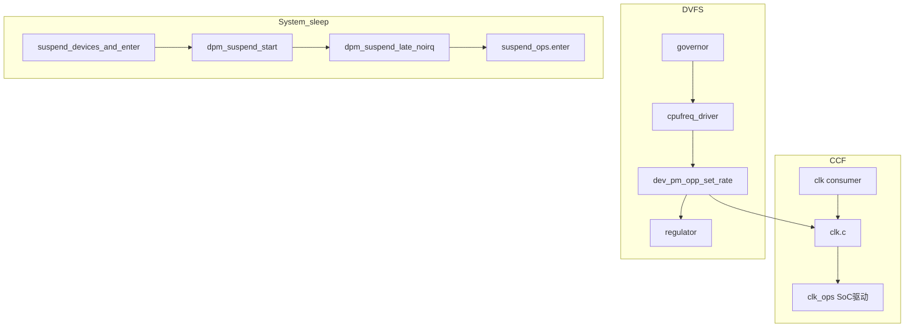

# 2010–2012 时钟 / DVFS / Suspend — 源码分步导读（带行号）

本文是 [01_2010-2012_clock_dvfs_suspend.md](01_2010-2012_clock_dvfs_suspend.md) 的**实操版**：按阶段给出阅读顺序、内核路径、关键行号与「为何如此设计」的注释。  
**基准树**：当前仓库主线语义（如 v6.15.x）；个别行号随版本漂移时，请以符号搜索为准。

---

## 一、整体架构（三条子系统、两条主路径）

1. **CCF（Common Clock Framework）**  
   把「时钟从哪来、谁在用、频率怎么改」收拢到统一 API；`prepare`/`enable` 分离是为了**可睡眠初始化**与**原子开关**共存。

2. **DVFS（cpufreq + OPP + regulator）**  
   Governor 只负责**策略**；真正动硬件常走 `dev_pm_opp_set_rate()`，在**升压/降压与改频顺序**上与硬件安全相关。

3. **系统休眠（kernel/power + DPM）**  
   先**冻结/停 governor**、再按阶段遍历设备的 `dev_pm_ops`；最后才 `suspend_ops->enter()` 进平台深度睡眠。  
   **原因**：越往后 I2C/regulator 等越可能不可用，故 cpufreq 必须在 `dpm_suspend` 早期被冻结。



**交叉约束**：DVFS 与 suspend **不同栈**，但共享时钟、电压与锁顺序；调试时要同时想两条链。

---

## 二、阶段 A — CCF：Consumer / Provider / Notifier

### A1 — Consumer API：`include/linux/clk.h`

**先读**：`PRE_RATE_CHANGE` / `POST_RATE_CHANGE` / `ABORT_RATE_CHANGE` 的文档注释（约 21–37 行）。  
**原因**：改频是**多订阅者协作**过程；任一 notifier 返回 `NOTIFY_BAD/STOP` 可中止整条改频，避免显示/总线在非法频率下工作。

**再读**：`devm_clk_get()` 注释（约 516–534 行）——明确返回的 clk **默认未 prepare、未 enable**。  
**原因**：probe 里常先 `devm_clk_get` 再按需 `clk_prepare_enable`，避免未使用的外设白白开钟漏电。

**再读**：内联封装（约 1141–1161 行）：

```1141:1161:include/linux/clk.h
/* clk_prepare_enable helps cases using clk_enable in non-atomic context. */
static inline int clk_prepare_enable(struct clk *clk)
{
	int ret;

	ret = clk_prepare(clk);
	if (ret)
		return ret;
	ret = clk_enable(clk);
	if (ret)
		clk_unprepare(clk);

	return ret;
}

/* clk_disable_unprepare helps cases using clk_disable in non-atomic context. */
static inline void clk_disable_unprepare(struct clk *clk)
{
	clk_disable(clk);
	clk_unprepare(clk);
}
```

**原因**：`prepare` 可睡眠（例如等锁相环稳定），`enable` 必须原子；组合 API 保证**先 prepare 再 enable**，失败时**回滚 unprepare**，避免半初始化状态。

**自检答案（计划中的问题）**：

- **只 `clk_enable` 不 `prepare`**：若该时钟的 `clk_ops.prepare` 做了必要初始化，则行为未定义或直接失败；CCF 用引用计数约束调用顺序。
- **`set_rate` 失败时 notifier**：见 A3 — 成功路径发 `POST_RATE_CHANGE`；中途失败会走 `ABORT_RATE_CHANGE` 通知（头文件 30–33 行语义）。

### A2 — Provider：`include/linux/clk-provider.h`

**重点读**：`struct clk_ops` 内核文档（约 87–178 行），尤其 `prepare`/`enable`/`set_rate`/`round_rate`。  
**原因**：SoC 驱动把这些回调填进 `clk_hw`，CCF 才能在**统一语义**下做 DVFS 与电源管理。

### A3 — 核心实现与 notifier：`drivers/clk/clk.c`

**搜索**：`__clk_speculate_rates`、`__clk_notify`、`PRE_RATE_CHANGE`。

示例（推测子树速率并发出 **PRE_RATE_CHANGE**）：

```2222:2250:drivers/clk/clk.c
static int __clk_speculate_rates(struct clk_core *core,
				 unsigned long parent_rate)
{
	struct clk_core *child;
	unsigned long new_rate;
	int ret = NOTIFY_DONE;

	lockdep_assert_held(&prepare_lock);

	new_rate = clk_recalc(core, parent_rate);

	/* abort rate change if a driver returns NOTIFY_BAD or NOTIFY_STOP */
	if (core->notifier_count)
		ret = __clk_notify(core, PRE_RATE_CHANGE, core->rate, new_rate);

	if (ret & NOTIFY_STOP_MASK) {
		pr_debug("%s: clk notifier callback for clock %s aborted with error %d\n",
				__func__, core->name, ret);
		goto out;
	}

	hlist_for_each_entry(child, &core->children, child_node) {
		ret = __clk_speculate_rates(child, new_rate);
		if (ret & NOTIFY_STOP_MASK)
			break;
	}

out:
	return ret;
}
```

**原因**：改频前**自顶向下**通知，让 DMA/显示等子系统在「旧速率仍有效」时停下敏感操作；子树递归保证**依赖关系**与硬件时钟树一致。

### A4（可选）— Gate helper：`drivers/clk/clk-gate.c`

**读**：文件头 DOC（约 17–25 行）与 `clk_gate_enable`/`disable`（约 56–99 行）。  
**原因**：门控是早期手机 SoC **最直观省电**手段；该 helper 把「寄存器某 bit」映射成标准 `clk_ops`，与 CCF 引用计数衔接。

---

## 三、阶段 B — DVFS：cpufreq-dt → OPP → Governor

### B1 — 数据结构：`include/linux/cpufreq.h`

关注 `struct cpufreq_policy`（CPU 掩码、`min`/`max`、`freq_table`、`clk`）、`struct cpufreq_driver` 的 `target_index` / `suspend` 等。  
**原因**：policy 是「一组 CPU 共享一条调频策略」的中心对象；`target_index` 把 governor 的**离散表项**交给驱动。

### B2 — DT + OPP 入口：`drivers/cpufreq/cpufreq-dt.c`

**核心竖切** — `set_target` 与 driver 注册：

```51:57:drivers/cpufreq/cpufreq-dt.c
static int set_target(struct cpufreq_policy *policy, unsigned int index)
{
	struct private_data *priv = policy->driver_data;
	unsigned long freq = policy->freq_table[index].frequency;

	return dev_pm_opp_set_rate(priv->cpu_dev, freq * 1000);
}
```

```140:154:drivers/cpufreq/cpufreq-dt.c
static struct cpufreq_driver dt_cpufreq_driver = {
	.flags = CPUFREQ_NEED_INITIAL_FREQ_CHECK |
		 CPUFREQ_IS_COOLING_DEV,
	.verify = cpufreq_generic_frequency_table_verify,
	.target_index = set_target,
	.get = cpufreq_generic_get,
	.init = cpufreq_init,
	.exit = cpufreq_exit,
	.online = cpufreq_online,
	.offline = cpufreq_offline,
	.register_em = cpufreq_register_em_with_opp,
	.name = "cpufreq-dt",
	.set_boost = cpufreq_boost_set_sw,
	.suspend = cpufreq_generic_suspend,
};
```

**原因**：cpufreq 层**不直接**写寄存器，而把「目标频率」交给 OPP 子系统，以便**同一套表**同时驱动 clock 与 regulator（若 DT 提供）。`freq * 1000` 因 cpufreq 表常用 **kHz**，而 OPP/clk 常用 **Hz**。  
`suspend` 挂 `cpufreq_generic_suspend`：若 DT 提供 suspend OPP 频率，休眠前会把 CPU 收到安全频点（见阶段 C）。

### B3 — OPP 核心：`drivers/opp/core.c`

**入口** `dev_pm_opp_set_rate()`（约 1338–1412 行）：`clk_round_rate`、`_find_freq_ceil` 选 OPP，最后 `_set_opp()`。

**竖切 `_set_opp()`**（约 1232–1333 行）— **升频与降频顺序不同**：

```1258:1296:drivers/opp/core.c
	scaling_down = _opp_compare_key(opp_table, old_opp, opp);
	if (scaling_down == -1)
		scaling_down = 0;

	/* Scaling up? Configure required OPPs before frequency */
	if (!scaling_down) {
		ret = _set_required_opps(dev, opp_table, opp, true);
		...
		ret = _set_opp_level(dev, opp);
		...
		if (opp_table->config_regulators) {
			ret = opp_table->config_regulators(dev, old_opp, opp,
							   opp_table->regulators,
							   opp_table->regulator_count);
			...
		}
	}

	if (opp_table->config_clks) {
		ret = opp_table->config_clks(dev, opp_table, opp, clk_data, scaling_down);
```

降频分支（约 1298–1325 行）则在**时钟降下来之后**再动 regulator 等。

**自检答案**：

- **切频失败时电压是否已动**：取决于失败点；若在 `config_regulators` 或 `config_clks` 返回错误，应阅读具体返回路径（`_set_opp` 内各 `if (ret) return ret`）。设计意图是**升频先加压、降频先降频**，减少欠压高频窗口。
- **OPP 不含 supply**：`dev_pm_opp_set_rate` 仍可能只通过 `config_clks`/空表路径调 clk（见同文件 1363–1375 行注释：**空 OPP 表 + clock** 时等价于 `clk_set_rate`）。

### B4 — DT 绑定：`include/linux/pm_opp.h`、`drivers/opp/of.c`

阅读 `operating-points-v2` 解析与 `dev_pm_opp_of_add_table` 一类符号。  
**原因**：硬件描述入口在 DT，驱动代码与表解耦。

### B5 — Governor 历史对照：`drivers/cpufreq/cpufreq_ondemand.c`

浏览采样与 `dbs` 数据结构即可；现代主线多用 `schedutil`，但 ondemand 体现 **「周期性看负载 → 调 target」** 的经典模型。  
**原因**：把 B2 的 `target_index` 放在「谁调用它」的语境里理解。

---

## 四、阶段 C — Suspend：全局顺序与 DPM

### C1 — 总入口：`kernel/power/suspend.c`

**`suspend_devices_and_enter()`**（约 494–541 行）：先 `dpm_suspend_start`，再循环 `suspend_enter`；唤醒后 `dpm_resume_end`。

**`suspend_enter()`**（约 409–487 行）要点顺序：

1. `platform_suspend_prepare`
2. `dpm_suspend_late` → `platform_suspend_prepare_late`
3. `dpm_suspend_noirq` → `platform_suspend_prepare_noirq`
4. `s2idle` 或关次核、`arch_suspend_disable_irqs`、`syscore_suspend`
5. **`suspend_ops->enter(state)`** — 平台真正进睡眠
6. 逆序恢复

**原因**：**普通 suspend** 的设备回调早于 `enter`；**late/noirq** 阶段留给必须晚关或关中断后仍要处理的外设。cpufreq 在 `dpm_suspend` 内被冻结（见 C3），故不会在 `enter` 之后乱改频。

### C2 — 平台钩子：`include/linux/suspend.h`

对照 `struct platform_suspend_ops` 各成员与 C1 中 `platform_suspend_*` 调用点。  
**原因**：SoC/BSP 把「进深度睡眠前最后几步」固定在这套契约里。

### C3 — 设备链：`drivers/base/power/main.c`

**`dpm_suspend_start()`**（约 2010–2022 行）：`dpm_prepare` → **`dpm_suspend`**。

**`dpm_suspend()`**（约 1758–1812 行）开头：

```1767:1791:drivers/base/power/main.c
	trace_suspend_resume(TPS("dpm_suspend"), state.event, true);
	might_sleep();

	devfreq_suspend();
	cpufreq_suspend();

	pm_transition = state;
	...
		error = device_suspend(dev, state, false);
```

**原因**：在遍历设备 `suspend` 之前**先停 cpufreq/devfreq**，避免 governor 在设备陆续休眠时仍访问已不可用的调压/调频路径（与 `cpufreq.c` 注释一致）。

**`dpm_resume()`** 末尾（约 1083–1084 行）`cpufreq_resume()` **在设备 resume 之后**调用，顺序与 suspend 对称。

### C4 — 驱动契约：`include/linux/pm.h`

精读 `struct dev_pm_ops`：`suspend` / `suspend_late` / `suspend_noirq` 与 runtime 回调分工。  
**原因**：驱动作者主要与这里打交道；阶段选错会导致休眠唤醒竞态。

### C5 — cpufreq 与系统休眠交叉：`drivers/cpufreq/cpufreq.c`

**`cpufreq_generic_suspend()`**（约 1984–2002 行）：若 `policy->suspend_freq` 非零，则 `__cpufreq_driver_target` 收到该频点。

**`cpufreq_suspend()`**（约 2006–2039 行）：对每个 active policy `cpufreq_stop_governor`，再调 `cpufreq_driver->suspend`。

**原因**：休眠路径上**冻结 governor + 可选固定 suspend 频点**，与 `cpufreq-dt` 在 `cpufreq_init` 里设置的 `policy->suspend_freq`（来自 `dev_pm_opp_get_suspend_opp_freq`）衔接。

---

## 五、阶段 D — Runtime PM、`pm_clk`、架构休眠

### D1 — Runtime PM：`drivers/base/power/runtime.c`

从 **`rpm_suspend()`**（约 571 行起）读：先 `rpm_check_suspend_allowed`，再处理 autosuspend 定时器，最后调用驱动的 `->runtime_suspend()`。  
**原因**：**空闲漏电**与系统级 suspend 正交；驱动常在 `runtime_suspend` 里 `clk_disable_unprepare`，与 A1 成对。

### D2 — `pm_clk`：`drivers/base/power/clock_ops.c`（需 `CONFIG_PM_CLK`）

**`pm_clk_suspend()`**（约 470–500 行）：逆序对设备注册的 clk 做 `clk_disable` / `clk_disable_unprepare`。

**原因**：把「系统休眠时要关哪些钟」从每个驱动复制粘贴，收敛为 **PM 子系统统一列表**；suspend 失败时可对照某设备是否注册了 `pm_clk`。

### D3 — sysfs / 冻结 / autosleep：`kernel/power/main.c`、`process.c`、`autosleep.c`

与 C1 的 `enter_state()`、`suspend_prepare`（进程冻结）串联阅读。  
**原因**：用户态 `echo mem > /sys/power/state` 的完整故事分散在多个文件。

### D4 — ARM64 平台：`arch/arm64/kernel/suspend.c`

读开头 `__cpu_suspend_exit`、以及文件中与 `cpu_suspend`、PSCI 协作部分（全文件约百余行量级）。  
**原因**：软件 DPM 走完后，**CPU 级上下文保存/恢复**在架构层闭合；与 `suspend_ops->enter` 对接。

---

## 六、实操清单

| 符号 / 函数 | 建议动作 |
|-------------|----------|
| `dev_pm_opp_set_rate` | 查找引用，看各驱动如何复用 OPP |
| `dpm_suspend` / `dpm_suspend_start` | 对照 `suspend_devices_and_enter` 时间线 |
| `suspend_devices_and_enter` | 与 `platform_suspend_ops` 表一起画时序图 |
| `__clk_notify` | 与 `PRE_RATE_CHANGE` 调用栈对照 |

---

## 七、与系列文档的交叉引用

- 概念地图：[01_2010-2012_clock_dvfs_suspend.md](01_2010-2012_clock_dvfs_suspend.md)
- 年度与实践：[../annual_reports/2010_annual_report.md](../annual_reports/2010_annual_report.md)、[phase1_cpu_pm.md](../learning_plan/phase1_cpu_pm.md)、[phase3_system_sleep.md](../learning_plan/phase3_system_sleep.md)

---

## 八、渐进阅读脚本（一次只读一小块）

用法：每次只完成**一个波浪号块**，合上编辑器或做笔记后再进入下一块。不要从上往下通读 `clk.c`（太大），按脚本走。

### 波浪 0 — 只建立「谁调用谁」（5 分钟）

1. 打开 [01_2010-2012_clock_dvfs_suspend.md](01_2010-2012_clock_dvfs_suspend.md) 里「调用链 / 数据流」的 mermaid。  
2. 自问：**改频**那条链和**休眠**那条链是否在同一个函数里汇合？（答：否；它们在约束上相交，调用栈不同。）  
3. 下一步：进入波浪 1。

### 波浪 1 — `clk.h`：notifier 三态（10 分钟）

1. 打开 `include/linux/clk.h`，**只读** 约 21–37 行（`PRE_RATE_CHANGE` 等注释）。  
2. 自问：若 PRE 阶段回调返回错误，内核还能不能把频率改成新值？（答：应中止；后续会发 `ABORT_RATE_CHANGE` 语义，见注释。）  
3. 下一步：波浪 2。

### 波浪 2 — `clk.h`：`devm_clk_get` 与 `clk_prepare_enable`（15 分钟）

1. **只读** `devm_clk_get` 的 kerneldoc（约 516–534 行）：记下「返回的 clk 默认未 prepare、未 enable」。  
2. **只读** `clk_prepare_enable` / `clk_disable_unprepare` 内联实现（约 1141–1161 行）。  
3. 自问：`enable` 失败时为什么要 `clk_unprepare`？（答：避免留下「已 prepare 未 enable」的半状态。）  
4. 下一步：波浪 3。

### 波浪 3 — `clk-provider.h`：只认 `struct clk_ops`（15 分钟）

1. 打开 `include/linux/clk-provider.h`，**只读** `struct clk_ops` 文档里关于 `prepare` / `enable` / `set_rate` 的三段说明。  
2. 自问：为什么 `prepare` 可以睡眠而 `enable` 不能？（答：与锁与上下文有关；CCF 用两套引用计数分离两类操作。）  
3. 下一步：波浪 4。

### 波浪 4 — `clk.c`：只跟 `PRE_RATE_CHANGE` 一处（20 分钟）

1. 在 `drivers/clk/clk.c` 里搜索 `__clk_speculate_rates`，**只读**该函数及紧挨着的 `__clk_notify(..., PRE_RATE_CHANGE, ...)` 调用。  
2. 自问：这里是「先通知再改硬件」还是「先改硬件再通知」？（答： speculate 路径上先 PRE 通知子树，再决定是否继续；与真正提交改频的配合在其它函数里，先建立直觉即可。）  
3. 下一步：波浪 5。

### 波浪 5 — `cpufreq-dt.c`：一行进 OPP（10 分钟）

1. 打开 `drivers/cpufreq/cpufreq-dt.c`，**只读** `set_target()` 函数体（约 51–57 行）和 `dt_cpufreq_driver` 里 `.target_index` / `.suspend`（约 140–154 行）。  
2. 自问：`freq * 1000` 的单位是什么？（答：表项多为 kHz，OPP/Hz。）  
3. 下一步：波浪 6。

### 波浪 6 — `opp/core.c`：只读 `_set_opp` 的 if 骨架（25 分钟）

1. 打开 `drivers/opp/core.c`，定位 `static int _set_opp(`。  
2. **不要**读完所有 helper，只读：`if (!scaling_down) { ... }`、`if (opp_table->config_clks)`、`if (scaling_down) { ... }` 三块的外层结构。  
3. 自问：升频时 regulator 大致在 clk 之前还是之后？降频呢？（答：升频先加压/相关配置再动频；降频先动频再降压 — 具体以 `config_regulators` 与 `config_clks` 分支为准。）  
4. 下一步：波浪 7。

### 波浪 7 — `suspend.c`：两个函数就够（20 分钟）

1. 打开 `kernel/power/suspend.c`。  
2. **先读** `suspend_devices_and_enter()`：找到 `dpm_suspend_start` 与 `suspend_enter` 的先后顺序。  
3. **再读** `suspend_enter()`：找到 `dpm_suspend_late`、`dpm_suspend_noirq`、`suspend_ops->enter` 的先后顺序。  
4. 自问：`dpm_suspend`（在 `dpm_suspend_start` 里）和 `enter` 谁先？（答：设备侧 `dpm_suspend_start` 在前；`enter` 在 `suspend_enter` 里很晚才调用。）  
5. 下一步：波浪 8。

### 波浪 8 — `main.c`：一眼看到 cpufreq 插在哪（10 分钟）

1. 打开 `drivers/base/power/main.c`，搜索 `void cpufreq_suspend`。  
2. **只读** `dpm_suspend()` 里 `cpufreq_suspend()` 前后几行。  
3. 自问：为何 cpufreq 要在 `device_suspend` 循环前停掉？（答：避免设备陆续休眠后 governor 仍调频访问已不可用路径。）  
4. 之后按需：波浪 9 = `clock_ops.c` 的 `pm_clk_suspend`；波浪 10 = `runtime.c` 的 `rpm_suspend` 开头。

---

*行号以撰写时 linux-stable 树为准；升级内核后请用 LSP/`rg` 以符号名重新定位。*
