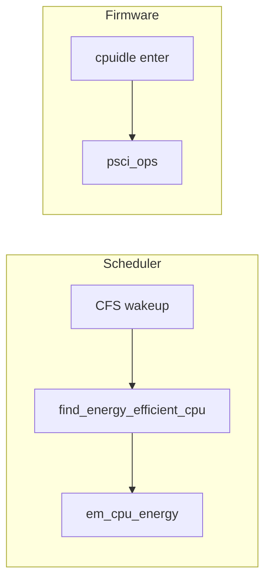

# 2013–2015 big.LITTLE / EAS / PSCI — 内核调度与固件

## 技术背景与演进脉络

**big.LITTLE** 把不同微架构的核放在同一 SoC 上：高性能 cluster 与高能效 cluster 并存。软件要解决：

1. **谁跑在哪种核上**（调度与容量感知）。
2. **cluster 级电源与一致性**（CCI、MCPM、早期切换器）。
3. **CPU 下线/上线与深睡** 由 **PSCI** 等固件接口统一描述，避免每家私有的汇编休眠协议。

**EAS（Energy Aware Scheduling）**：在**上游主线**中，完整形态（`CONFIG_SCHED_ENERGY` + Energy Model）晚于 2015；但**语义上**是「非对称容量 + 能耗表 + CFS 选核」的延续。读代码时应区分：**历史 Android/厂商补丁** vs **当前 `kernel/sched/fair.c` + `energy_model.c`**。

**PSCI**：ARM 标准化 `CPU_ON`/`CPU_OFF`/`CPU_SUSPEND` 等，使 arm64 与多厂商固件互操作。

## 内核代码地图

### big.LITTLE（含 32 位时代标本）

| 路径 | 职责 |
|------|------|
| `arch/arm/common/bL_switcher.c` | Cluster 切换核心：配对 CPU、切换请求与 notifier |
| `arch/arm/include/asm/bL_switcher.h` | `bL_switch_request*`、`bL_switcher_register_notifier` 等 |
| `arch/arm/common/mcpm_entry.c` / `mcpm_platsmp.c` | MCPM：多 cluster 电源管理与 SMP 启动衔接 |
| `arch/arm/include/asm/mcpm.h` | MCPM 平台回调声明 |
| `drivers/cpufreq/vexpress-spc-cpufreq.c` | Versatile Express SPC 双 cluster cpufreq（与 `CONFIG_BL_SWITCHER` 联动） |
| `drivers/cpufreq/cpufreq-dt-platdev.c` | DT cpufreq 平台设备；含与 BL switcher 共存的注释/分支 |
| `drivers/bus/arm-cci.c` | ARM CCI 一致性互连（与 cluster 缓存一致性相关） |
| `include/linux/arm-cci.h` | CCI 探测与 port 控制 API |
| `drivers/cpuidle/cpuidle-big_little.c` | big.LITTLE 专用 idle driver（文件头注释讨论 menu governor 与 cluster 建模） |

### EAS 与拓扑、容量（主线当前实现）

| 路径 | 职责 |
|------|------|
| `kernel/sched/fair.c` | `find_energy_efficient_cpu()`、`compute_energy()`、`energy_env`（EAS 核心） |
| `kernel/sched/topology.c` | 调度域、`sd_asym_cpucapacity`、EAS 启用条件、与 schedutil 关系 |
| `kernel/power/energy_model.c` | EM 子系统：注册 performance domain、与 cpufreq/debugfs |
| `include/linux/energy_model.h` | `struct em_perf_domain`、`em_cpu_energy()`、`em_dev_register_perf_domain()` |
| `drivers/base/arch_topology.c` | `cpu_scale`、频率标尺、`rebuild_sched_domains_energy()` |
| `include/linux/arch_topology.h` | `topology_get_cpu_scale()`、`cluster_id` 等 |
| `kernel/sched/cpufreq_schedutil.c` | schedutil（EAS 常与之协同，详见文档 03） |
| `kernel/sched/pelt.c` | PELT 负载，与容量缩放一起作为 EAS 输入 |

### PSCI

| 路径 | 职责 |
|------|------|
| `drivers/firmware/psci/psci.c` | 通用 PSCI：特性探测、`CPU_SUSPEND`/`CPU_ON`/`CPU_OFF`、system off 等 |
| `include/linux/psci.h` | `struct psci_operations`、`psci_dt_init()`、`psci_cpu_suspend_enter()` |
| `include/uapi/linux/psci.h` | 函数号、power state 位域（用户态/KVM 共享） |
| `arch/arm64/kernel/psci.c` | arm64 CPU ops：`cpu_on`/`cpu_off` 与 `psci_ops` 绑定 |
| `arch/arm/kernel/psci_smp.c` | ARM32 PSCI SMP 启动路径 |

### CPU idle（ARM 通用与 PSCI）

| 路径 | 职责 |
|------|------|
| `include/linux/cpuidle.h` | `struct cpuidle_state`、`cpuidle_device`、`CPUIDLE_FLAG_*` |
| `drivers/cpuidle/cpuidle.c` / `driver.c` / `governor.c` | 框架与 governor 挂载 |
| `drivers/cpuidle/governors/menu.c` | Menu governor（历史上与 cluster idle 建模有张力） |
| `drivers/cpuidle/cpuidle-arm.c` | 通过 CPU ops 进入 SoC idle（`arm,idle-state`） |
| `drivers/cpuidle/cpuidle-psci.c` | **PSCI CPU idle**（现代 arm64 常见路径） |
| `drivers/cpuidle/cpuidle-psci-domain.c` | PSCI + 电源域层次化 idle |
| `drivers/cpuidle/dt_idle_states.c` | 从 DT 解析 idle 状态 |

## 核心数据结构

- **`struct psci_operations`**：`cpu_suspend`、`cpu_on`、`cpu_off` 等；架构无关代码通过它调用固件。
- **`struct em_perf_domain` / `struct em_perf_state`**：每个 performance domain 的频率—功耗—容量表；`em_cpu_energy()` 供调度器快速估算。
- **`struct cpuidle_state`**：`target_residency` vs `exit_latency` 权衡决定是否值得进深睡（**与 cluster 下电时序强相关**）。

## 关键 API

| API | 说明 |
|-----|------|
| `bL_switch_request_cb()` | 请求切换 cluster（仅 BL switcher 路径） |
| `psci_cpu_suspend_enter()` | 进入固件协调的 CPU suspend（常由 cpuidle 调用） |
| `em_cpu_energy()` | EAS 路径估算能耗 |
| `topology_set_cpu_scale()` / `arch_scale_cpu_capacity()` | 非对称 CPU 容量暴露给调度器 |

## 调用链 / 数据流

**原因说明**：调度器侧用 EM 在**可运行 CPU 集合**上选能耗更优目标；idle 路径则必须经 **PSCI/平台** 保证 GIC、时序、cluster 状态一致，否则表现为随机唤醒失败或 IRQ 风暴。

## 代码阅读指引

1. **PSCI**：`drivers/firmware/psci/psci.c` → `arch/arm64/kernel/psci.c` → `drivers/cpuidle/cpuidle-psci.c`。
2. **EAS**：`kernel/sched/topology.c` 查 EAS 启用条件 → `fair.c` 搜 `energy_aware` / `find_energy_efficient_cpu` → `energy_model.c`。
3. **big.LITTLE 历史**：`bL_switcher.c` + `cpuidle-big_little.c` 对照注释理解「governor 假设单 CPU idle」与 **cluster 关断** 的冲突。

## 与年度报告交叉引用

- [../annual_reports/2013_annual_report.md](../annual_reports/2013_annual_report.md)
- [../annual_reports/2014_annual_report.md](../annual_reports/2014_annual_report.md)
- [../annual_reports/2015_annual_report.md](../annual_reports/2015_annual_report.md)
