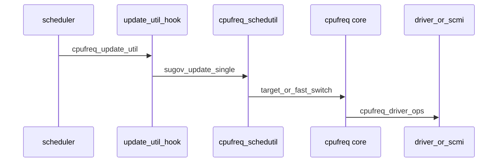

# 2016–2017 schedutil / DynamIQ / SCMI — 内核框架与协议

## 技术背景与演进脉络

1. **schedutil**：用调度器**实时利用率**驱动 cpufreq，取代大量 tick 采样的 governor；与 **fast switch**、**非对称拓扑**、后期 EAS 形成闭环。
2. **DynamIQ**：硬件上 cluster 与共享 L3 等拓扑变化；内核侧**通常不**出现字符串「DynamIQ」，而是通过 **DT/ACPI topology**、`cpu_topology`、`cacheinfo` 与 **DSU PMU** 等体现。
3. **SCMI**：应用处理器与 **SCP/System Control Processor** 之间的消息协议，把 **perf/clock/power/sensor** 抽到固件侧，内核用统一 `scmi_handle` 消费。

**为何这一档叫「框架/协议」**：schedutil 是**跨调度器与 cpufreq 的框架钩子**；SCMI 是**跨传输（mailbox/SMC/virtio）的协议栈**，下面可接多家 SoC 固件。

## 内核代码地图

### schedutil 与调度器—cpufreq 桥梁

| 路径 | 职责 |
|------|------|
| `kernel/sched/cpufreq_schedutil.c` | schedutil governor：`sugov_policy`/`sugov_cpu`、`get_next_freq`、irq_work/kthread 慢路径 |
| `kernel/sched/cpufreq.c` | `cpufreq_add_update_util_hook()`、连接调度器与 governor |
| `include/linux/sched/cpufreq.h` | `struct update_util_data`、`map_util_freq()`、`SCHED_CPUFREQ_*` 标志 |
| `kernel/sched/build_utility.c` | 将 `cpufreq_schedutil.c` 编进 sched 构建 |
| `kernel/sched/fair.c` / `rt.c` / `deadline.c` | 在适当时机调用 `cpufreq_update_util()` |
| `kernel/sched/topology.c` | EAS 与 schedutil 关系、调度域标志 |
| `drivers/cpufreq/cpufreq.c` | `cpufreq_enable_fast_switch()`、`__cpufreq_driver_target()` |
| `arch/arm64/kernel/topology.c` | 频率标尺、AMU 等与「频率不变性」相关（影响 schedutil 映射） |

### DynamIQ / DSU（可观测性为主）

| 路径 | 职责 |
|------|------|
| `drivers/perf/arm_dsu_pmu.c` | DynamIQ Shared Unit PMU 驱动（perf 事件、overflow） |
| `arch/arm64/include/asm/arm_dsu_pmu.h` | CLUSTERPM* 寄存器访问封装 |
| `Documentation/devicetree/bindings/perf/arm,dsu-pmu.yaml` | DT binding |
| `kernel/sched/topology.c` + `drivers/base/arch_topology.c` | cluster/package 与 capacity（调度与功耗策略的输入） |

### SCMI 协议栈与消费者

| 路径 | 职责 |
|------|------|
| `drivers/firmware/arm_scmi/driver.c` | 核心：传输、handle、协议注册 |
| `drivers/firmware/arm_scmi/bus.c` | `scmi_device` 总线 |
| `drivers/firmware/arm_scmi/base.c` | Base 协议 |
| `drivers/firmware/arm_scmi/perf.c` | Performance 协议（性能域、OPP 与固件侧限频） |
| `drivers/firmware/arm_scmi/power.c` | Power 域 |
| `drivers/firmware/arm_scmi/clock.c` | Clock 协议 |
| `drivers/firmware/arm_scmi/voltage.c` | Voltage 协议 |
| `drivers/firmware/arm_scmi/sensors.c` | Sensor（温度等） |
| `drivers/firmware/arm_scmi/notify.c` | 事件通知（如性能限制变化） |
| `drivers/firmware/arm_scmi/transports/*.c` | mailbox、SMC、OP-TEE、virtio 等 |
| `include/linux/scmi_protocol.h` | `scmi_*_proto_ops` 公共接口面 |
| `drivers/cpufreq/scmi-cpufreq.c` | SCMI Performance → cpufreq（含 fast switch、事件订阅） |
| `drivers/clk/clk-scmi.c` | SCMI Clock → CCF |
| `drivers/pmdomain/arm/scmi_pm_domain.c` | genpd 与 SCMI 桥接 |
| `drivers/regulator/scmi-regulator.c` | 调节器抽象 |

### Thermal（与限频闭环）

| 路径 | 职责 |
|------|------|
| `include/linux/thermal.h` | `thermal_zone_device_ops`、`thermal_cooling_device_ops` |
| `drivers/thermal/thermal_core.c` | 热区与 trip |
| `drivers/thermal/cpufreq_cooling.c` | cpufreq 作为 cooling device（与 DVFS 限频联动） |
| `drivers/thermal/thermal_of.c` | cooling-map 解析 |

## 核心数据结构

- **`struct update_util_data`**：schedutil 挂在每 CPU 上的钩子；回调在持 `rq->lock` 上下文中运行，**不可睡眠**——这是许多设计约束的根源。
- **`struct scmi_handle` / `struct scmi_protocol_handle`**：固件会话；上层只面对 `scmi_*_proto_ops`。
- **`struct sugov_cpu` / `struct sugov_policy`**：schedutil 内部状态，区分 shared policy 与 per-CPU 更新。

## 关键 API

| API | 说明 |
|-----|------|
| `cpufreq_add_update_util_hook()` | governor 注册利用率回调 |
| `cpufreq_update_util()` | 调度器触发（CFS/RT/DL） |
| `cpufreq_driver_fast_switch()` | 硬件快速切频路径（低延迟场景） |
| `scmi_perf_proto_ops` 成员（见 `scmi_protocol.h`） | 固件侧设置频率/限制 |

## 调用链 / 数据流

**原因说明**：事件从「调度事实」出发，避免 governor 与真实 runnable 脱节；若底层是 **SCMI**，则 `HW` 实际变成「写共享内存 + 触发 doorbell」，延迟与竞态模型与本地寄存器写不同（可参考 `case_studies/case03_scmi_resume_race.md`）。

## 代码阅读指引

1. `include/linux/sched/cpufreq.h` → `kernel/sched/cpufreq.c`（钩子语义）→ `cpufreq_schedutil.c`（`get_next_freq`）。
2. `drivers/cpufreq/scmi-cpufreq.c` 对照 `arm_scmi/perf.c` 理解固件限频如何反馈到内核。
3. `arm_dsu_pmu.c` 仅负责 **perf 计数**；调度策略仍看 `topology.c` / `arch_topology.c`。

## 与年度报告交叉引用

- [../annual_reports/2016_annual_report.md](../annual_reports/2016_annual_report.md)
- [../annual_reports/2017_annual_report.md](../annual_reports/2017_annual_report.md)
- 案例：[../case_studies/case03_scmi_resume_race.md](../case_studies/case03_scmi_resume_race.md)、[../case_studies/case05_schedutil_spurious_updates.md](../case_studies/case05_schedutil_spurious_updates.md)
