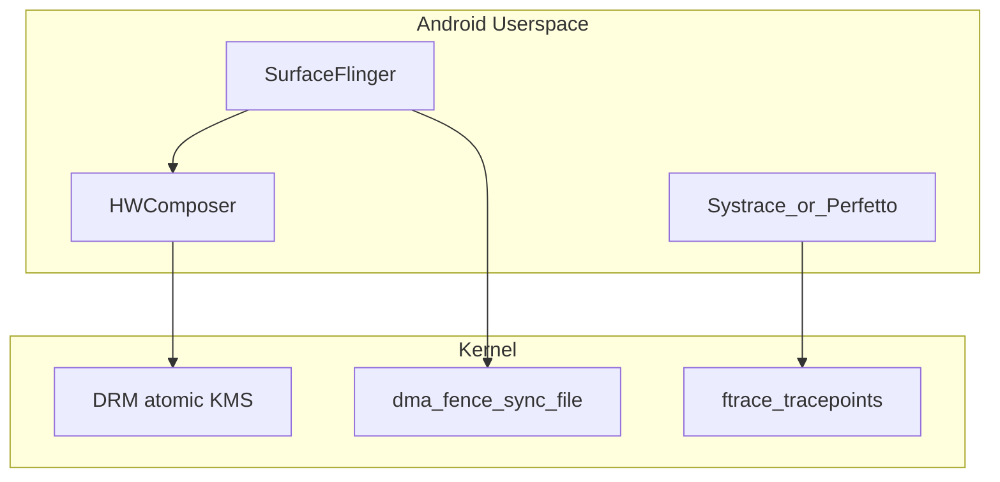

# 2018–2019 SurfaceFlinger / Systrace / VRR — Android Framework 与内核接口

## 技术背景与演进脉络

这一阶段行业焦点在：

- **合成与显示管线**：Android **SurfaceFlinger** 协调 Layer、BufferQueue、HWComposer；**完全在用户态/AOSP**，不在 Linux 内核树。
- **性能剖析**：**Systrace** 依赖内核 **ftrace/tracepoint** + 用户态 atrace；内核提供「事件源」，不叫「Systrace」。
- **可变刷新率 VRR**：减少固定刷新带来的拖影/撕裂感知；内核侧主要体现在 **DRM/KMS 原子属性**、**DP Adaptive-Sync** 与驱动私有实现。

**为何文档仍放在「低功耗」主题下**：VRR / 自适应同步允许面板在内容静止时**降低有效刷新**或拉长帧间隔，与整机功耗、热设计相关；profiling 则是调优 **CPU/GPU/显示** 协同时序的工具链。

## 内核代码地图（本树可查部分）

### DRM 核心：VRR 属性

| 路径 | 职责 |
|------|------|
| `drivers/gpu/drm/drm_mode_config.c` | 注册默认属性 **`VRR_ENABLED`**（`prop_vrr_enabled`） |
| `drivers/gpu/drm/drm_atomic_uapi.c` | atomic commit 中读写 `state->vrr_enabled` |
| `drivers/gpu/drm/drm_connector.c` | **`vrr_capable`** 文档与 API；与 CRTC 上 `VRR_ENABLED` 的配合说明 |
| `include/drm/drm_connector.h` / `drm_crtc.h` / `drm_mode_config.h` | 属性与状态结构声明 |
| `include/drm/drm_edid.h` | EDID 中与 VRR 相关描述符位 |

### DisplayPort / Adaptive-Sync

| 路径 | 职责 |
|------|------|
| `include/drm/display/drm_dp.h` | `DP_SDP_ADAPTIVE_SYNC` 等常量 |
| `include/drm/display/drm_dp_helper.h` | `struct drm_dp_as_sdp`、`drm_dp_as_sdp_supported()` |
| `drivers/gpu/drm/display/drm_dp_helper.c` | SDP 辅助实现 |

### 驱动示例（主线中实现较完整）

| 路径 | 职责 |
|------|------|
| `drivers/gpu/drm/i915/display/intel_vrr.c` | Intel 显示 VRR 主逻辑 |
| `drivers/gpu/drm/i915/display/intel_vrr_regs.h` | 寄存器定义 |
| `drivers/gpu/drm/i915/display/intel_vblank.c` | `I915_MODE_FLAG_VRR` 与 vblank |
| `drivers/gpu/drm/i915/display/intel_dp.c` / `intel_hdmi.c` | Adaptive-Sync 能力上报 |
| `drivers/gpu/drm/amd/display/amdgpu_dm/amdgpu_dm.c` | AMD：atomic 中 `vrr_capable`/`vrr_enabled` |
| `drivers/gpu/drm/amd/display/amdgpu_dm/amdgpu_dm_trace.h` | tracepoint 中带 `vrr_enabled` |

### MIPI DSI 与移动 SoC

移动设备常见 **DSI/eDP 面板**；主线中 **「DSI VRR」** 很少作为统一子系统命名出现，多分散在 **SoC DRM 驱动 + panel driver** 中。读代码时以 **具体 SoC**（如 `msm`、`mediatek`、`rockchip`）的 CRTC/bridge 路径为准。

### Tracing（Systrace 的内核层）

| 路径 | 职责 |
|------|------|
| `include/trace/trace_events.h` | `TRACE_EVENT` 宏基础设施 |
| `kernel/trace/trace.c` 等 | ftrace 核心 |
| `include/trace/events/dma_fence.h` | **dma_fence** 生命周期（合成/GPU/显示同步常用） |
| 各 DRM 驱动 `*_trace.h` | 驱动私有 tracepoint（如 `vc4_trace.h`、`amdgpu_dm_trace.h`） |

## Android 用户态（不在本仓库）

| 组件 | 作用 | 与内核关系 |
|------|------|------------|
| SurfaceFlinger | 合成、VSYNC、HWC 调度 | ioctl/drm/mapper、fence fd |
| Systrace / Perfetto | 抓取调度/GPU/显示事件 | 读写 `tracefs`、atrace 配置 |
| HWComposer HAL | 选择 Overlay/Client 合成 | 厂商实现对接内核驱动 |

## 核心数据结构（DRM）

- **`vrr_enabled`**（atomic state）：用户态声明「内容适合 VRR」；驱动据此调整模式或 porch。
- **`vrr_capable`**（connector 属性）：硬件/链路是否支持 VRR 类能力。

## 关键 API / UAPI 面

- DRM **atomic ioctl**：通过 property 设置 `VRR_ENABLED`（具体 property 名称由内核 DRM 核心注册）。
- **dma_fence**：`sync_file`、EGL/Vulkan 与内核 fence 导入导出（跨进程与跨设备同步）。

## 调用链 / 数据流（概念）

## 代码阅读指引

1. 从 `drm_connector.c` 搜 `vrr_capable` 理解**能力与使能**分离的设计意图。
2. 选一条桌面路径读 `intel_vrr.c` 或 `amdgpu_dm.c`，再对照 `drm_atomic_uapi.c` 看属性如何进 commit。
3. 性能分析：读 `include/trace/events/dma_fence.h`，再在设备上 `tracepoint enable` 验证事件是否与 Systrace 类别对应。

## 与年度报告交叉引用

- [../annual_reports/2018_annual_report.md](../annual_reports/2018_annual_report.md)
- [../annual_reports/2019_annual_report.md](../annual_reports/2019_annual_report.md)
