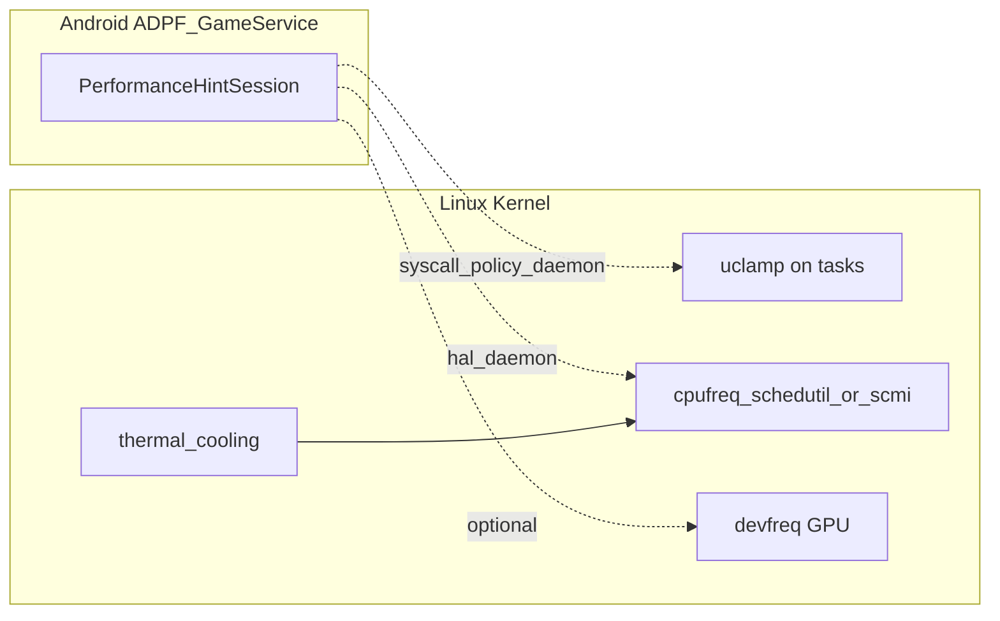

# 2020–2021 PerformanceHint / LTPO / ADPF — Framework-HAL 与内核机制

## 技术背景与演进脉络

- **PerformanceHint**（Android）：Framework 向调度/电源栈传达「预期负载」或「帧deadline」类提示；**主线内核无同名模块**，常见落点是 **sched_attr / uclamp**、**cpufreq 策略**、厂商扩展。
- **LTPO**：面板可**动态调低刷新**以降低功耗；硬件多为 **OLED + 可变驱动**；内核侧常表现为 **VRR/自刷新/PSR** 等能力的组合，**很少出现字面 `LTPO`**。
- **ADPF**（Android Dynamic Performance Framework）：**不在主线 Linux 源码**；通过 **Java/Kotlin API** 与系统服务聚合热状态、Game Mode、CPU/GPU 提示。内核提供 **thermal、cpufreq、GPU devfreq、uclamp** 等「旋钮」。

**为何必须写清边界**：避免在内核树里 `grep ADPF` 无果后误判「不支持」——实际是**用户态策略框架**。

## 内核代码地图

### Util clamp（与「性能提示」强相关）

| 路径 | 职责 |
|------|------|
| `kernel/sched/syscalls.c` | `uclamp_validate`、`SCHED_FLAG_UTIL_CLAMP_*`、`sched_setattr` 路径 |
| `kernel/sched/core.c` / `fair.c` | uclamp 在调度实体上的生效、与容量/频点映射交互 |
| `include/linux/sched/types.h`（及 sched.h 相关） | `struct sched_attr` 中 uclamp 字段 |
| Kconfig：`CONFIG_UCLAMP_TASK` | 编译开关 |

**原理要点**：uclamp 给任务设定**利用率上下界**，调度器在选核与映射频率时可避免「过度降频导致卡顿」或「过度升频浪费电」。这与 PerformanceHint「保帧」目标一致。

### PM QoS / 频率约束

| 路径 | 职责 |
|------|------|
| `kernel/power/qos.c` | CPU/DMA 等 QoS 约束框架 |
| `include/linux/pm_qos.h` | 请求类型与 API |

**原理要点**：子系统可登记「最低延迟/最高唤醒时间」等约束，**阻止**电源管理把设备降到不满足约束的状态；与「性能提示」同属**跨子系统协商**机制。

### 显示省电：PSR / Self-refresh（与 LTPO 场景相关）

| 路径 | 职责 |
|------|------|
| `include/drm/display/drm_dp.h` | `DP_PSR_*` 等 eDP PSR 常量 |
| `drivers/gpu/drm/drm_dp_helper.c` | DP 辅助（含 PSR 相关辅助路径，视配置） |
| SoC 驱动如 `drivers/gpu/drm/msm/dp/dp_panel.c` | 读取 `DP_PSR_SUPPORT` 等 DPCD |
| `drivers/gpu/drm/i915/display/intel_psr.c`（若存在） | Intel PSR 实现 |
| 文档 04 中 **VRR** 属性 | 与可变刷新策略协同 |

**原理要点**：**PSR** 让面板/链路在静态画面时减少更新；**LTPO** 在硬件上提供更细的刷新与漏电控制——内核驱动仍落在 **DRM 模式、面板电源、DSC/PSR/VRR** 组合上。

### devfreq（GPU / 内存控制器等）

| 路径 | 职责 |
|------|------|
| `drivers/devfreq/devfreq.c` | devfreq 核心 |
| `include/linux/devfreq.h` | governor 与设备 profile |
| 各 SoC `drivers/gpu/*` 或 `drivers/devfreq/*` | 与 ADPF「GPU 侧 hint」的硬件接口 |

## 核心数据结构

- **`struct sched_attr`**：扩展调度参数；uclamp 通过 `sched_setattr` 类系统调用进入内核。
- **`struct dev_pm_qos_request`**：PM QoS 请求节点，链入约束列表。

## 关键 API

| API | 说明 |
|-----|------|
| `sched_setattr()` / `sched_getattr()` | 用户态设置调度属性（含 uclamp，视配置） |
| `pm_qos_add_request()` 等 | 登记 QoS 约束 |

## 调用链 / 数据流（概念）

虚线表示 **AOSP 实现依赖具体版本与厂商**，本树仅含右侧内核框。

## 代码阅读指引

1. 在 `kernel/sched/syscalls.c` 搜 `uclamp_validate` 跟踪从用户态到 `sched_uclamp_enable()` 的路径。
2. 读 `kernel/power/qos.c` 理解**约束与 refcount**如何影响 idle 选择。
3. 显示：结合文档 04 的 `VRR_ENABLED`，再在目标 SoC 的 DRM 驱动中搜 `psr`、`self_refresh`。

## 与年度报告交叉引用

- [../annual_reports/2020_annual_report.md](../annual_reports/2020_annual_report.md)
- [../annual_reports/2021_annual_report.md](../annual_reports/2021_annual_report.md)
