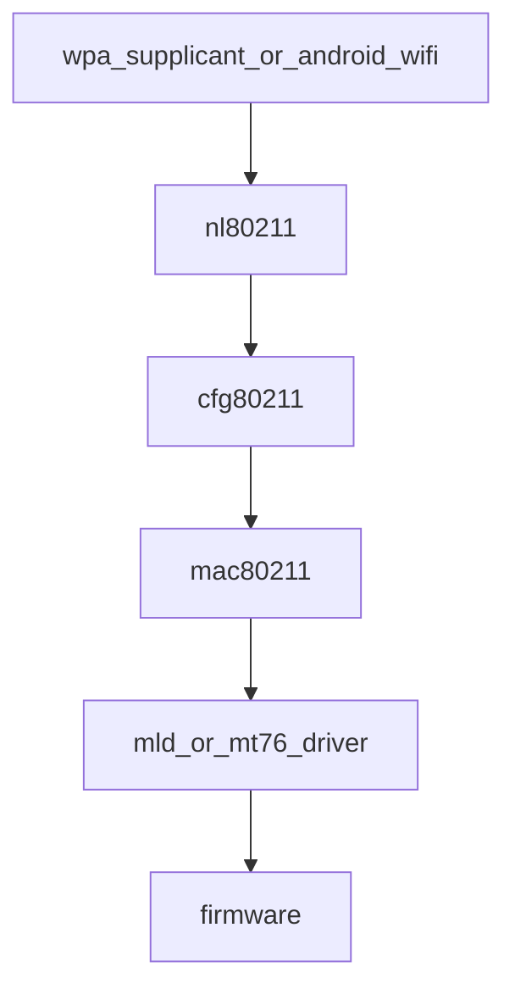

# 2022–2023 GameMode / LLM / Wi‑Fi 7 — Framework-AI 与内核无线栈

## 技术背景与演进脉络

- **GameMode**：Android 上聚合通知、性能模式、网络优先等；**内核无统一 `GameMode` 接口**（个别 HID 等无关命中需忽略）。低延迟路径通常涉及：**CPU 亲和**、**uclamp**、**cpufreq 下限**、**Wi‑Fi 省电关闭**、**调度优先级**——分散在通用子系统中。
- **LLM**：大模型推理主要在 **用户态框架 + 加速器驱动**（见文档 07）；2022–2023 为产品爆发期，内核侧是 **NPU/GPU 驱动与 DMA-BUF** 的延续，而非「LLM」字符串。
- **Wi‑Fi 7（802.11be / EHT）**：内核 **cfg80211/mac80211** 与驱动扩展 **EHT 能力、RU、GI** 等；与省电（TWT、传统 PS）共存需读 **mac80211 pm** 路径。

## 内核代码地图

### Wi‑Fi 7 / EHT

| 路径 | 职责 |
|------|------|
| `include/uapi/linux/nl80211.h` | `NL80211_ATTR_EHT_CAPABILITY`、`NL80211_ATTR_DISABLE_EHT`、EHT 相关枚举 |
| `net/wireless/nl80211.c` | 用户态配置与能力下发 |
| `net/wireless/util.c` | `cfg80211_calculate_bitrate_eht()` 等 |
| `net/mac80211/*.c` | `ieee80211_eht_*`、STA 链路能力、MLD（多链路设备）相关（随版本演进） |
| `drivers/net/wireless/intel/iwlwifi/mld/` | Intel Wi‑Fi 7 一代驱动示例 |
| `drivers/net/wireless/mediatek/mt76/*` | MediaTek 芯片族 EHT 路径示例 |

### Wi‑Fi 省电

| 路径 | 职责 |
|------|------|
| `net/mac80211/pm.c` | `IEEE80211_CONF_PS`、动态省电 |
| `net/mac80211/mlme.c` / `cfg.c` | 与 AP 协商省电模式 |
| `net/mac80211/mesh_ps.c` | Mesh 省电 |

**原理要点**：**省电增加休眠时间**可能增大延迟；GameMode 类产品倾向在「游戏场景」关闭 STA PS 或调整聚合参数——具体在 **厂商 HAL/firmware**，内核提供 **nl80211/mac80211** 能力。

### 与游戏场景相关的通用内核机制（无 GameMode 专名）

| 路径 | 职责 |
|------|------|
| `kernel/sched/` | RT/DL、隔离 CPU、`isolcpus` |
| `kernel/sched/syscalls.c` | uclamp（见文档 05） |
| `drivers/cpufreq/` | 最低频率、boost（厂商驱动） |
| `net/core/pkt_sched.c` 等 | QoS（若产品做「游戏包优先」） |

## 核心数据结构

- **`struct ieee80211_sta_ht_cap` / EHT 扩展能力结构**（随头文件演进）：描述 STA/VIF 对 EHT 的支持；驱动与 mac80211 在关联时协商。
- **`struct ieee80211_conf`**：含 `flags` 中的 powersave 位，影响 `pm.c` 行为。

## 关键 API / netlink 属性

- **`NL80211_CMD_SET_WIPHY`** 等 + EHT 属性：用户态配置是否宣告/禁用 EHT。
- **`ieee80211_hw_conf`** 中的 PS 标志：由栈设置、驱动实现射频侧休眠策略。

## 调用链 / 数据流（Wi‑Fi）

**原因说明**：EHT 能力最终要落到 **firmware 与射频**；内核负责**一致的能力模型**与**省电状态机**，避免用户态与固件语义漂移。

## 代码阅读指引

1. `nl80211.h` 搜 `EHT` 建立 UAPI 心智模型。
2. `mac80211` 中搜 `ieee80211_eht` 看能力如何绑定到 `sta`。
3. 对比 `pm.c` 中 PS 开启/关闭对 TX 队列的影响（延迟 vs 功耗）。

## LLM（简述）

推理栈：**Runtime（ONNX/ExecuTorch 等）→ 驱动 ioctl → GEM/BO → firmware**。内核关键词用文档 07 的 **`drivers/accel`** 与 **DMA-BUF**，而非 `LLM`。

## 与年度报告交叉引用

- [../annual_reports/2022_annual_report.md](../annual_reports/2022_annual_report.md)
- [../annual_reports/2023_annual_report.md](../annual_reports/2023_annual_report.md)
