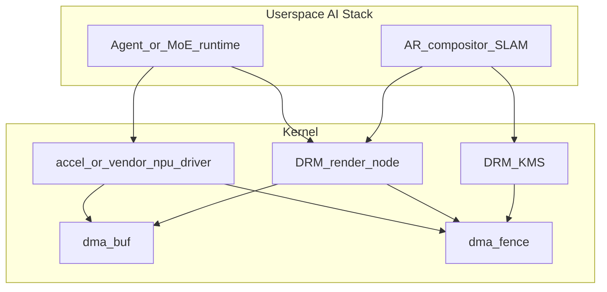

# 2024–2025 Agent / MoE / AR — AI 全栈与内核边界

## 技术背景与演进脉络

- **Agent / MoE**：属于**应用层与模型架构**；内核不参与「智能体推理图」本身，只提供 **稳定、可审计** 的计算与 I/O 原语：**加速器驱动、DMA、内存共享、调度、电源**。
- **AR**：涉及 **相机、传感器融合、显示低时延、GPU 合成**；内核侧分散在 **V4L2、DRM、IIO、dma-buf fence** 等；无单一 `AR` 子系统。
- **NPU / AI 加速器**：主线通过 **`drivers/accel`**（DRM accel 子系统）等形式统一部分设备模型；移动端厂商 NPU 仍大量在 **vendor 内核** 或 **out-of-tree**。

**为何强调边界**：把「Agent」当成内核模块会误导排障方向；正确路径是 **用户态 orchestration → 驱动 → firmware**。

## 内核代码地图

### Accelerator 子系统（`drivers/accel`）

| 路径 | 职责 |
|------|------|
| `drivers/accel/drm_accel.c` | accel 设备与 DRM 集成入口 |
| `drivers/accel/amdxdna/` | AMD NPU（固件 mailbox、队列、调试） |
| `drivers/accel/ivpu/` | Intel VPU（客户端推理加速器） |
| `drivers/accel/qaic/` | Qualcomm Cloud AI 等 |
| `drivers/accel/habanalabs/` | Habana 数据中心加速器 |
| `include/trace/events/amdxdna.h` | 示例：accel 路径上的 tracepoint |

> 手机 SoC 上常见 **高通 QNN / 三星 / 联发科** NPU 驱动**不一定**在本主线树；可对照 **interconnect** 中 `npu_noc` 等节点理解带宽拓扑：`drivers/interconnect/qcom/*.c`。

### 跨设备内存与同步

| 路径 | 职责 |
|------|------|
| `drivers/dma-buf/dma-buf.c` | dma-buf 核心：共享 buffer、attach/detach |
| `drivers/dma-buf/dma-buf-cache.c` | 缓存一致性与 sync |
| `drivers/dma-buf/udmabuf.c` | 用户态可 mmap 的 dma-buf 创建（测试/通用路径） |
| `include/trace/events/dma_fence.h` | fence 跟踪（GPU/NPU/显示同步） |

### GPU 计算与显示（AR 相关）

| 路径 | 职责 |
|------|------|
| DRM **render node** | 用户态 OpenCL/Vulkan 计算（驱动具体文件因厂商而异） |
| `drivers/gpu/drm/*/*_gem.c` | GEM BO 分配、与 dma-buf 导入导出 |

### Android ION

**主线树通常不含** Android ION 分配器；移动共享内存历史方案多迁移到 **dma-buf heap**（若厂商内核启用）。

## 核心数据结构

- **`struct dma_buf`** / **`struct dma_buf_ops`**：跨驱动共享内存的 ops 表；**原因**：NPU/GPU/相机管道需要零拷贝或低拷贝。
- **`struct accel_device`（DRM accel）**：统一部分加速器设备生命周期（具体字段以头文件为准）。

## 关键 API

| API | 说明 |
|-----|------|
| `dma_buf_export()` / `dma_buf_attach()` | 导出 buffer、绑定到另一设备 |
| `dma_fence_*` | 异步计算完成信号，与显示提交对齐 |

## 调用链 / 数据流（概念）

## 代码阅读指引

1. 从 `drivers/dma-buf/dma-buf.c` 理解 **file-backed dma-buf** 生命周期。
2. 选一条主线 accel 驱动（如 `ivpu` 或 `amdxdna`）跟 **firmware 加载 → job submit** 路径。
3. AR：串联 **V4L2 捕获** → **dma-buf** → **GPU/显示**（按目标平台驱动目录搜索 `dmabuf`、`fence`）。

## 与年度报告交叉引用

- [../annual_reports/2024_annual_report.md](../annual_reports/2024_annual_report.md)
- [../annual_reports/2025_annual_report.md](../annual_reports/2025_annual_report.md)
